# Desafio Final:

## Breve Resumo:

#### O desafio todo começou a ser desenvolvido na Sprint 6 até a Sprint 10, em 5 etapas, tendo como base um arquivo CSV e da API TMDB em formato JSON criando os Bancos de Dados de Séries e Filmes do gênero Ação e Aventura. 

## Etapa 1:
#### Foi feita uma análise de banco de dados para extrair informações sobre séries e filmes. O objetivo é responder a questões definidas que nos permitam extrair informações relevantes. 
#### Nessa etapa defini as perguntas a qual seriam feitas as análises. Foram modificadas algumas das perguntas para que se encaixasse melhor na análise final na ferramenta da AWS QuickSight.

#### As perguntas atualizadas são as seguintes: 
#### Séries:
#### 1.	Quais artistas mais atuaram em séries?
#### 2.	Qual a quantidade de Séries por ano nos últimos 10 anos?
#### 3.	Quais séries com melhores notas por quantidade de votos?
#### 4.	Qual a quantidade de votos e média por linguagem/idioma?
#### Filmes: 
#### 1.	Quais as notas e votos dos filmes lançados em 2024?
#### 2.	Qual a quantidade de filmes lançados nos últimos 10 anos?
#### 3.	Qual top 5 de votos de popularidade de filme?
#### 4.	Quais as notas, votos e popularidade dos filmes lançados em 2024?
#### Posteriormente, fiz um script python que lê os arquivos CSV, acessa a AWS, cria Bucket e faz upload dos arquivos no bucket. Também utilizei o programa Docker para construir um contêiner que executa um script Python.

## Etapa 2: 
#### Criei uma conta no site TMDB e criei uma API.
#### Fiz um script python, que interage com a API do TMDB para obter dados sobre filmes e séries e armazena esses dados no Amazon S3 em lotes de 100 registros em formato JSON. Os dados são organizados por data e divididos em lotes, que são então carregados no S3.  Também foi usado o serviço da AWS Lambda e Amazon Event Bridge que faz o agendando extrações periódicas de dados de forma automática. Posteriormente foram adicionados mais dados do TMDB.

## Etapa 3:
#### Usei o serviço AWS Glue Studio para criar e gerenciar tarefas de ETL, dos jobs "moviesAndSeries"  e "jsonTMDB", que lê dados de um arquivo, filtra registros com gêneros Action e Adventure e salva os dados filtrados no formato Parquet. Também foi usado o serviço da AWS Athena para consulta dos dados gerados. 

## Etapa 4: 
#### O desafio foi resolvido usando o serviço AWS Glue para ler o arquivo parquet, modificá-lo e salva-lo na refined zone. Onde os dados foram lidos de um arquivo Parquet, processado para criar uma tabela de fatos e várias tabelas de dimensões, escrevendo essas tabelas em novos arquivos Parquet.
#### Posteriormente, usando  crawler  para pegar os dados salvos no refined zone que estavam no formato parquet e criar um banco de dados no serviço AWS Athena, onde criei views e também tabelas. 

# Etapa 5 - Resolução do Desafio da Sprint 10: 

## Arquivo:  
[Dashboard em PDF](Desafio/Dashboard.pdf)

## Introdução: 

#### Após a ingestão, armazenamento e processamento dos dados em um data lake, criei um dashboard no AWS QuickSight, usando o Athena como fonte de dados. Dessa forma, foi criado uma visualização de dados para apresentar uma narrativa eficaz dos dados.

## QuickSight

### Criação do Dashoboard: 

## 1. Cliquei no menu em:  Analyses > New analysis > New dataset > Athena
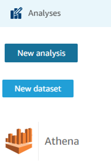

## 2. Escolhe o nome e depois clica em "Create data source"
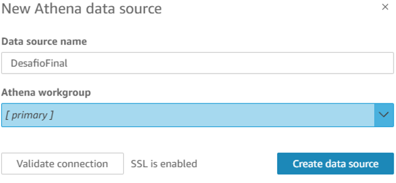

## 3. Seleciona o Catalog e o Database onde estão salvos a base de dados  e a tabela que deseja usar OU clica em "Use custom SQL". Optei por usar a segunda opção, pois já fazia um select especificamente do que eu iria usar nos gráficos do Dashboad, usando  dados do Athena. 
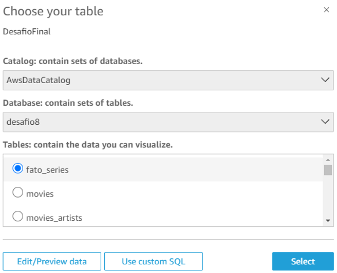

## 4. Usando a opção "Use custom SQL", faz o select especifico na query, cria um nome e clica em "Confirm query". Dessa forma a tabela abre no QuickSight.
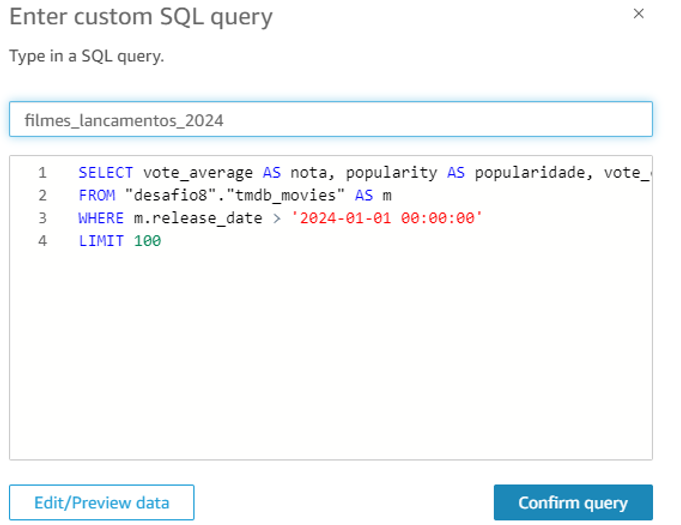

## 5. Criando as querys dos gráficos de séries: 
### Artistas que mais atuaram em séries:
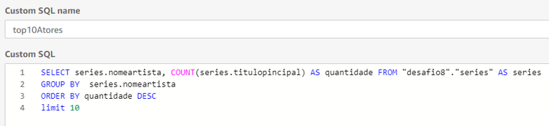
#### Quantidade de séries lançadas nos últimos 10 anos:
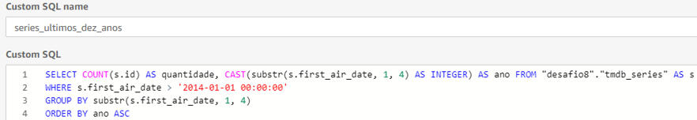
#### Séries com melhores notas por quantidade de votos:
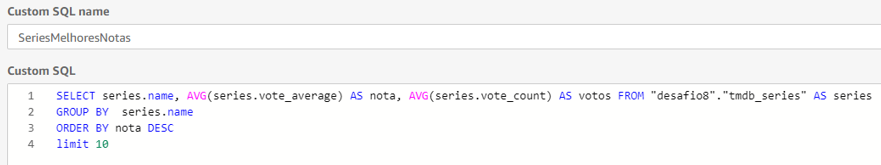
#### Quantidade votos e média de nota por idioma da série 
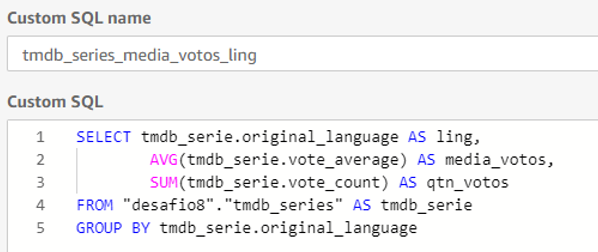

## 6. Criando as querys dos gráficos de filmes: 
### Notas e votos dos filmes lançados em 2024
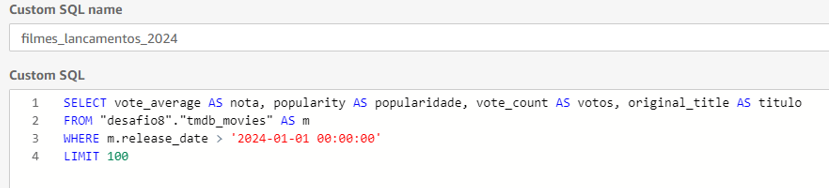
### Quantidade de filmes lançados nos últimos 10 anos
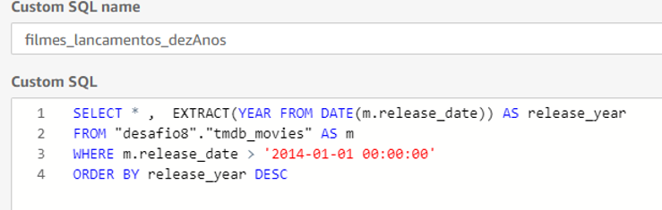
### Top 5 popularidade por filme - usei tabela toda
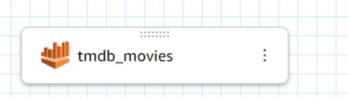
### Notas, votos e popularidade dos lançamentos de 2024
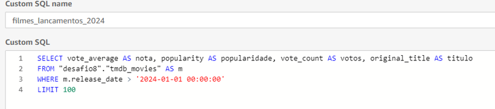

## 7. Dashboard - Editando e Criando a visualização

### Séries Ação/Aventura

### Visão Geral:
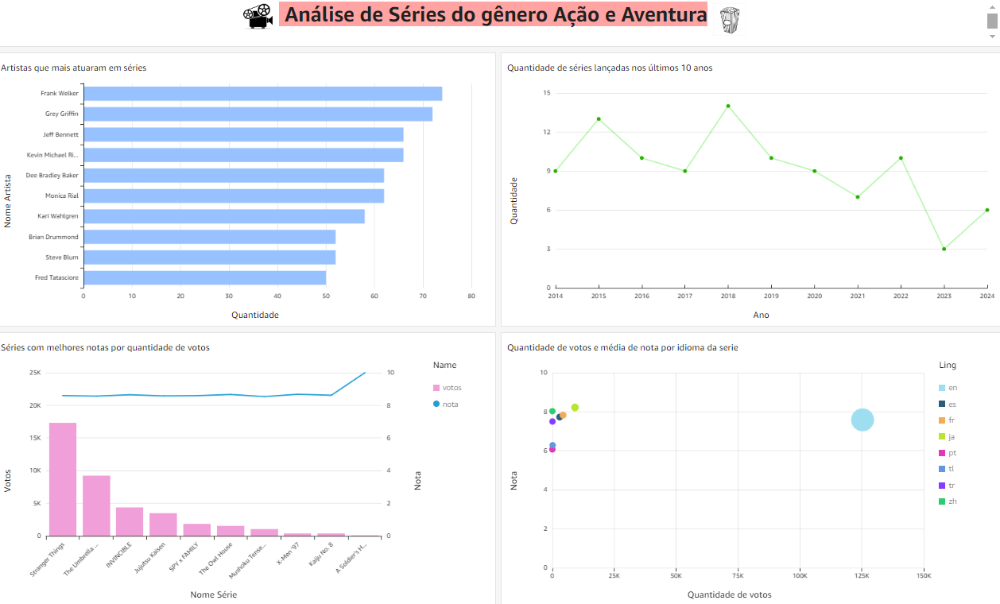

### 1. Artistas que mais atuaram em séries:
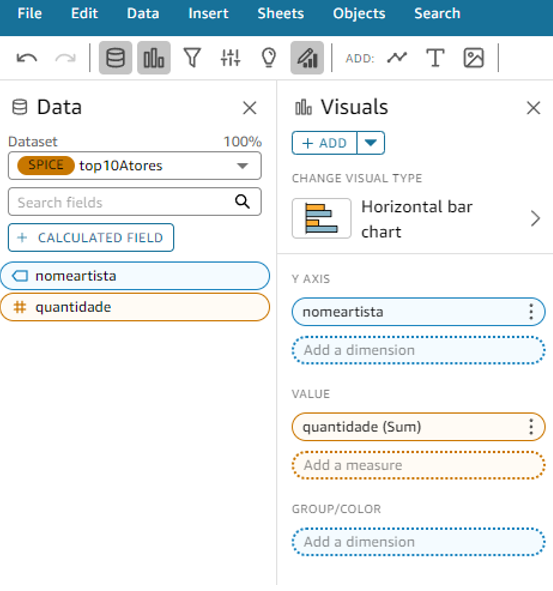

### O gráfico de barras horizontais mostra os artistas que mais atuaram em séries, destacando Frank Welker como o mais prolífico, com quase 80 participações. Outros artistas como Grey Griffin e Jeff Bennett também possuem altas quantidades de trabalhos, com mais de 70 séries cada. O eixo Y lista os nomes dos artistas, enquanto o eixo X representa a quantidade de séries em que atuaram, indicando que todos os artistas apresentados possuem um número significativo de participações em séries.
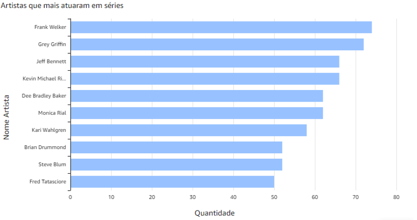

### 2. Quantidade de séries lançadas nos últimos 10 anos:
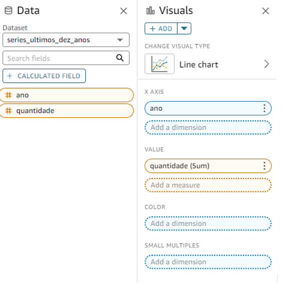

### O gráfico mostra a quantidade de séries lançadas nos últimos 10 anos, de 2014 a 2024. Em 2015 e 2018, houve picos de lançamentos, com o número de séries atingindo 13 e 15, respectivamente. A partir de 2019, nota-se uma tendência de queda, com um mínimo de 3 séries lançadas em 2023. No entanto, há uma leve recuperação em 2024, com o número de lançamentos subindo para 6.

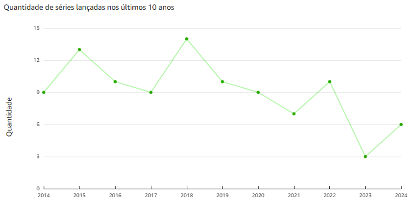

### 3. Séries com melhores notas por quantidade de votos:
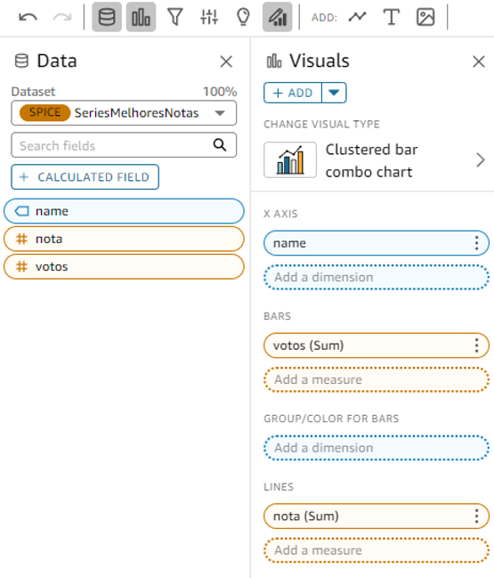

### O gráfico exibe as séries com as melhores notas em função da quantidade de votos recebidos. A série "Stranger Things" se destaca com a maior quantidade de votos, ultrapassando 15 mil, enquanto as outras séries, como "The Umbrella Academy" e "INVINCIBLE", têm significativamente menos votos, mas ainda são notáveis em comparação com as demais. A linha azul representa as notas médias dessas séries, que permanecem relativamente estáveis em torno de 8,5 a 9,5, exceto por uma ligeira elevação para 10 em uma das séries listadas. Isso sugere que, apesar da variação na quantidade de votos, as séries listadas mantêm uma alta avaliação entre os espectadores.
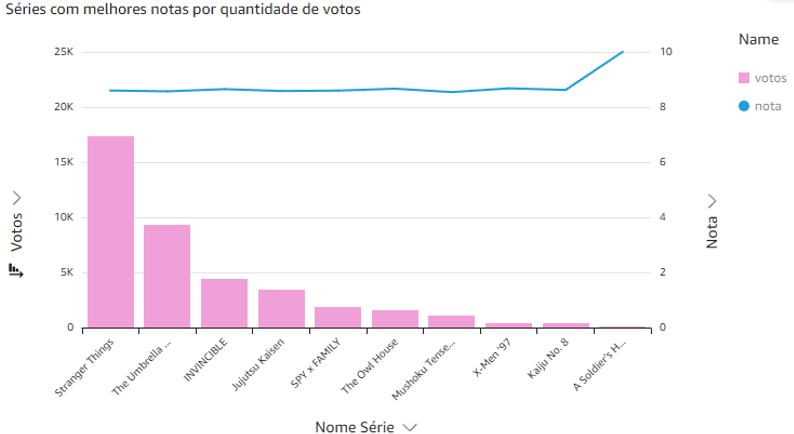

### 4. Quantidade votos e média de nota por idioma da série 
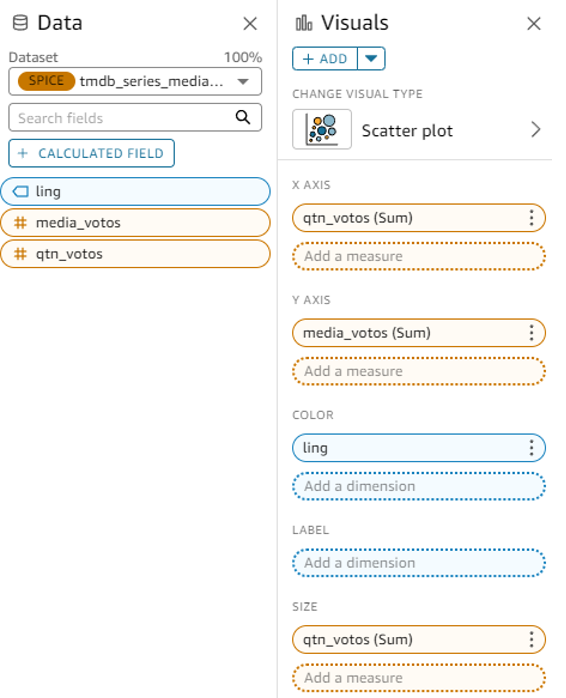

### O gráfico de dispersão mostra a relação entre a quantidade de votos e a média de notas por idioma das séries. Cada ponto representa um idioma, e o tamanho do ponto reflete o volume de votos. As séries em inglês ("en") destacam-se por terem a maior quantidade de votos, ultrapassando 125 mil, com uma média de nota próxima a 8. Os outros idiomas, como chinês ("zh"), turco ("tr"), e português ("pt"), têm uma quantidade significativamente menor de votos, todos concentrados em menos de 25 mil, com notas variando entre 6 e 8,5. Este gráfico evidencia que séries em inglês dominam em termos de popularidade (quantidade de votos) enquanto mantêm uma média alta de avaliações, comparado com séries em outros idiomas.
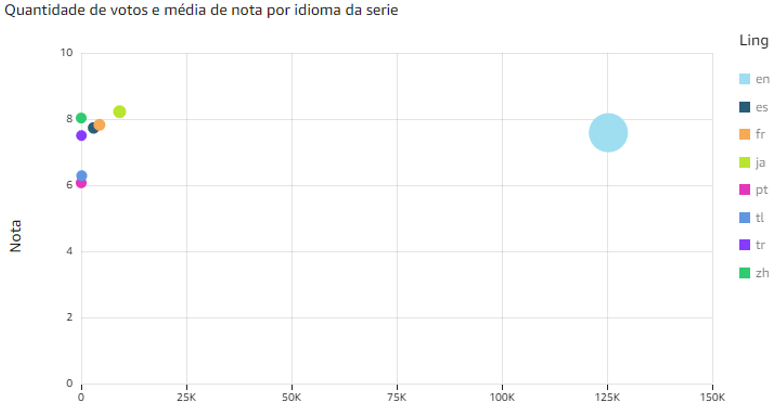

### Filmes Ação/Aventura 

### Visão Geral:
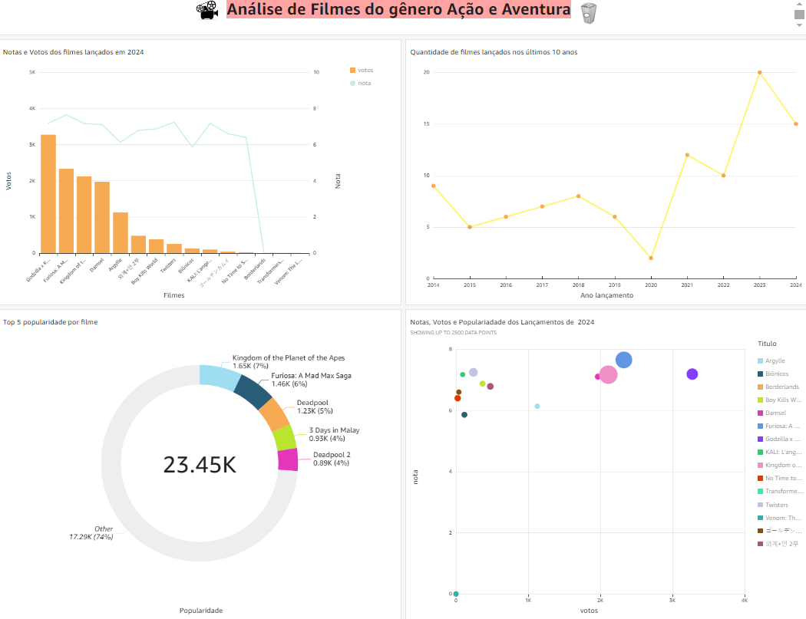

### 1.  Notas e Votos dos filmes lançados em 2024:
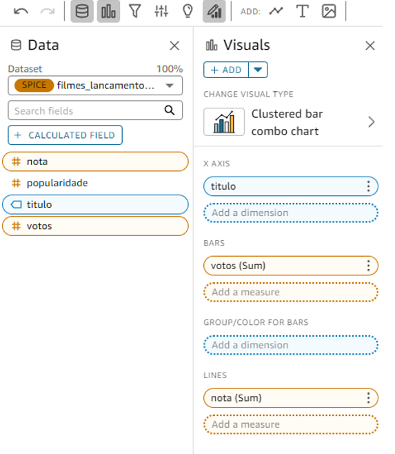

### O gráfico mostra a distribuição de votos e a média de notas dos filmes lançados em 2024. As barras laranjas representam a quantidade de votos, enquanto a linha verde representa a nota média. O filme "Godzilla K.K." lidera em termos de votos, com mais de 3 mil, seguido por "Furiosa: A.M." e "Kingdom of the Planet of the Apes", ambos com cerca de 2,5 mil votos. Apesar disso, a nota média desses filmes fica entre 6 e 8, com algumas exceções que atingem quase 10. Observa-se uma queda acentuada na quantidade de votos à medida que se avança na lista de filmes, com os últimos filmes recebendo menos de 500 votos. Além disso, os filmes com menos votos tendem a ter notas variáveis, algumas muito baixas, como "Transformers" e "Venom", que registram notas próximas a zero. Isso sugere que, embora alguns filmes sejam muito populares em termos de participação do público, suas avaliações variam bastante, com alguns recebendo críticas severas.
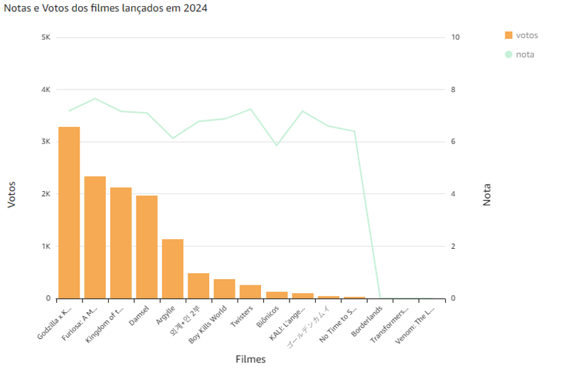

### 2. Quantidade de filmes lançadas nos últimos 10 anos:
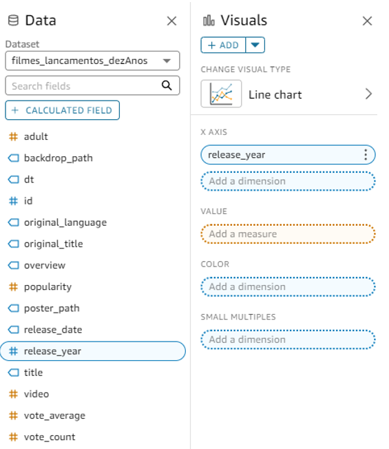

### O gráfico mostra a quantidade de filmes lançados entre 2014 e 2024. No início do período, em 2014, foram lançados cerca de 10 filmes, mas esse número caiu para aproximadamente 5 em 2015, e permaneceu relativamente estável nos anos seguintes, com pequenas flutuações. A partir de 2020, há uma queda acentuada, atingindo o ponto mais baixo com menos de 5 filmes lançados. Entretanto, a partir de 2021, observa-se uma recuperação significativa, culminando em um pico de lançamentos em 2022, com cerca de 18 filmes. Em 2023, houve uma leve queda, mas ainda se mantiveram números elevados em comparação aos anos anteriores. Em 2024, o número de lançamentos diminui um pouco, mas continua acima da média dos primeiros anos analisados. Esse padrão sugere uma retomada na produção de filmes após um período de baixa, com um crescimento notável nos últimos anos.

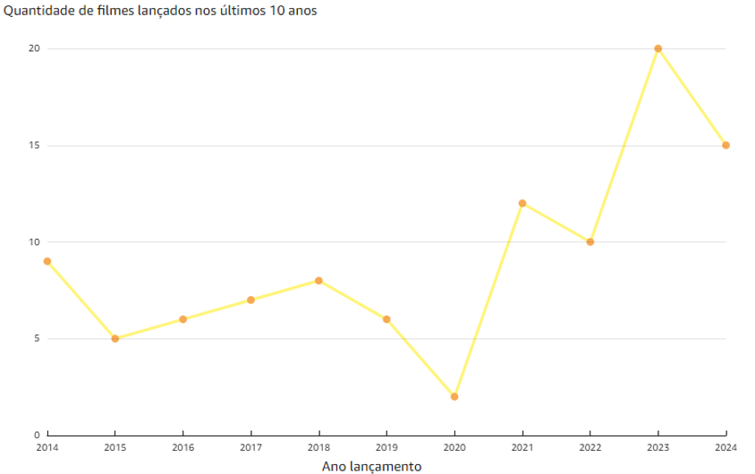

### 3. Top 5 maiores popularidades de filmes:

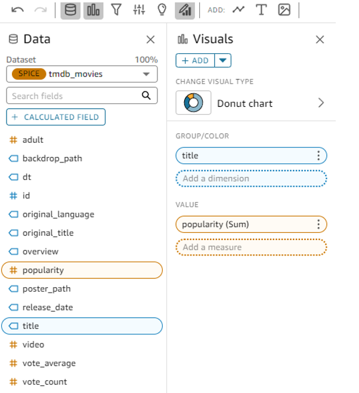

### O gráfico de rosca exibe as cinco maiores popularidades de filmes, mostrando o total acumulado de 23,45 mil. O filme "Kingdom of the Planet of the Apes" lidera com 1,65 mil, representando 7% da popularidade total. Seguem "Furiosa: A Mad Max Saga" com 1,46 mil (6%), "Deadpool" com 1,23 mil (5%), "3 Days in Malay" com 0,93 mil (4%), e "Deadpool 2" com 0,89 mil (4%). A categoria "Other" agrupa os filmes restantes, somando 17,29 mil, o que representa a maior parte, com 74% da popularidade total. Este gráfico sugere que, apesar de alguns filmes específicos se destacarem, a maior parte da popularidade está distribuída entre vários outros títulos não especificados individualmente.

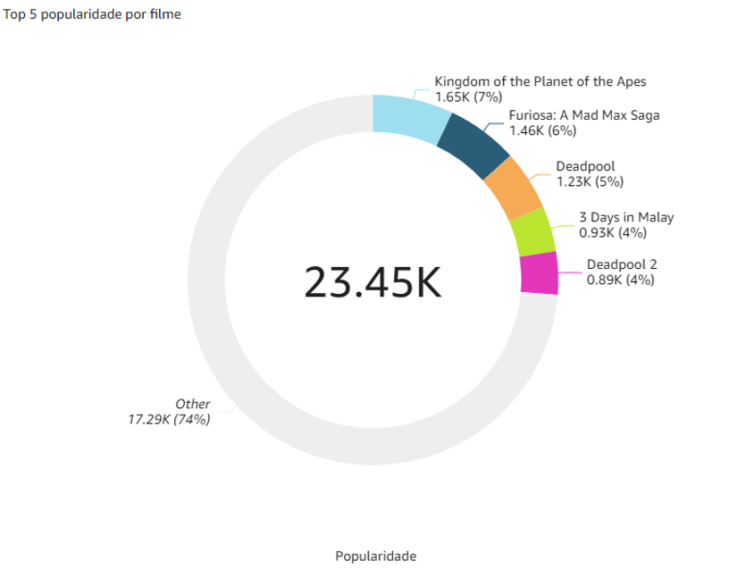

### 4.  Notas, votos e popularidade dos filmes lançados em 2024

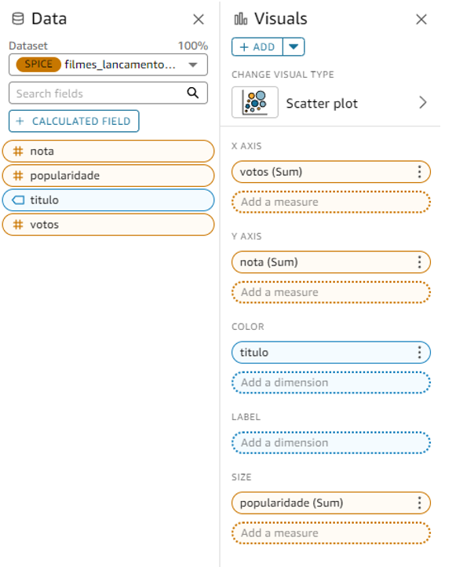

### O gráfico de bolhas mostra a relação entre notas, votos e popularidade dos filmes lançados em 2024. Cada bolha representa um filme, onde o eixo horizontal indica o número de votos, o eixo vertical mostra a nota média, e o tamanho da bolha representa a popularidade do filme. Filmes como "Furiosa: A Mad Max Saga" e "Godzilla x Kong" aparecem com grandes bolhas, indicando alta popularidade e um número significativo de votos. Estes filmes também possuem notas acima de 6, mas não atingem o máximo de 8. Outros filmes, como "Kingdom of the Planet of the Apes," têm notas próximas de 8, com um bom número de votos e uma bolha de tamanho médio, indicando popularidade moderada. Há filmes que, apesar de terem notas mais baixas, ainda possuem um número considerável de votos, como "Biônicos" e "Borderlands." Por outro lado, algumas bolhas menores e mais próximas da origem representam filmes com menor popularidade, votos e notas. Em resumo, o gráfico destaca uma correlação entre popularidade, votos e notas, mas também mostra que filmes altamente votados nem sempre têm as melhores notas, sugerindo uma diversidade de opiniões entre os espectadores.

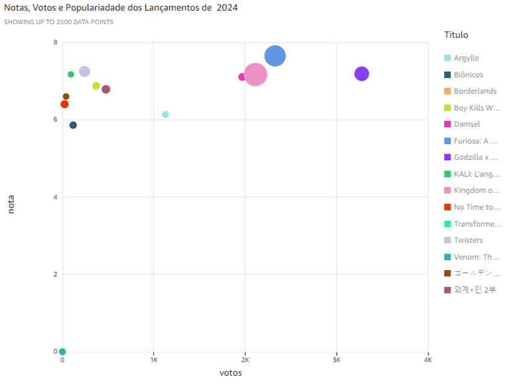

## 8. Personalizando: 

### Para editar, colocar logotipo e mudar a cor:
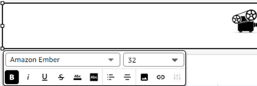

### Para mudar a cor do gráfico, clica com botão direito do mouse no gráfico e seleciona a cor desejada: 
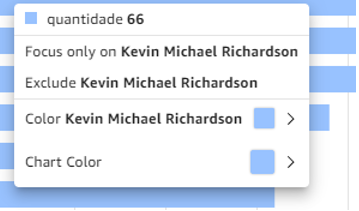

### Para editar a visualização do gráfico, como nome, cliquei em propriedades:
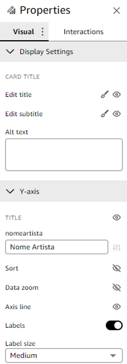

### Para selecionar o tipo de gráfico:  
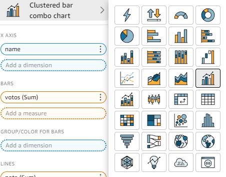

# Sobre o Programa de Bolsas:

## Como eu imagino que os conhecimentos obtidos no decorrer do Programa de Bolsas podem gerar valor para os clientes da Compass:

### Imagino que os conhecimentos adquiridos ao longo do Programa de Bolsas capacitam para projetar e implementar soluções de dados escaláveis, seguras e eficientes na nuvem, utilizando serviços avançados da AWS. Com habilidades que vão desde análise de dados com Python e SQL até a construção de Data Lakes e visualização de dados com Amazon QuickSight, é possível transformar dados complexos em insights acionáveis, otimizar processos e reduzir custos operacionais. Isso permite entregar soluções inovadoras e de alto impacto, alinhadas às necessidades e objetivos dos clientes, gerando valor sustentável e melhorando a tomada de decisões estratégicas.

# FIM.

