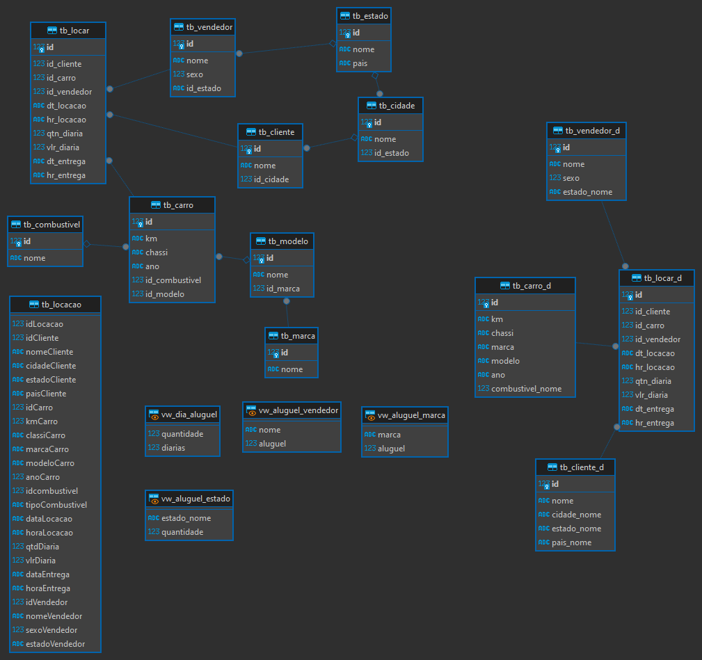

# Exercícios

1. Exercicios 1 ao 16

[Resposta 1 ao 16](exercicios/Exercicios_Sprint_2.txt)

2. Exercicio Exportacao de Dados

[Exportacao de Dados 1](exercicios/exportacao_1.csv) 

[Exportacao de Dados 2](exercicios/exportacao_2.csv)

# Evidências

Este diagrama representa a estrutura do banco de dados, mostrando como as diferentes tabelas estão relacionadas entre si e como as views fornecem uma visão agregada dos dados. Ele oferece uma visão geral do esquema de banco de dados e das relações entre suas entidades.

# Certificados

- Certificado do Curso AWS

# Desafio
1. [Explicacao](Desafio/explicacao_desafio/explicacao.txt)

2. [Modelo Relacional](Desafio/RelacionalScript.sql)

3. [Modelo Dimensional e Views](Desafio/DimensionalScript.sql)

