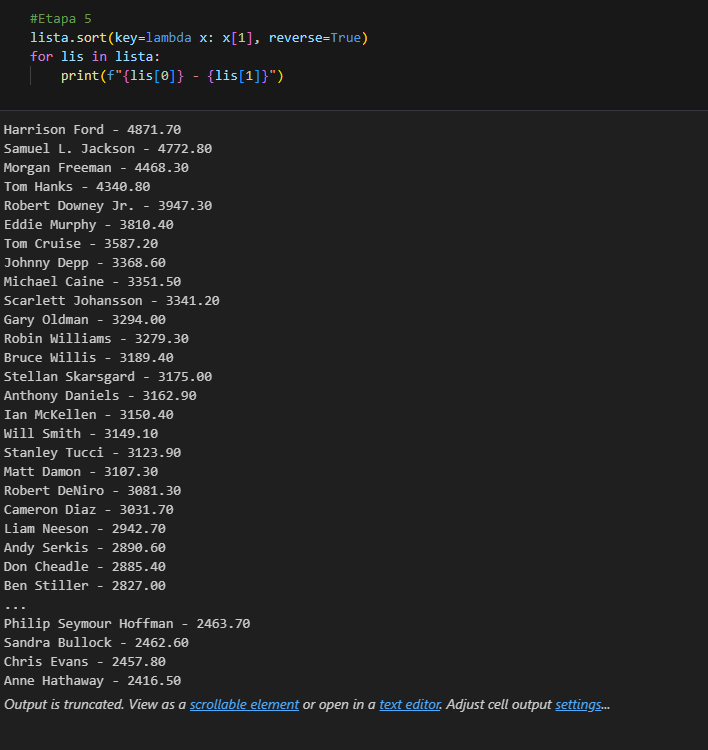

# Exercícios

1. Exercicios Parte I - 1 ao 25

[Resposta 1 ao 25 em formato .ipynb](exercicios/Exercicios_I.ipynb)

2. Exercicios Parte II 

[Arquivo de dados actors .csv](exercicios/actors.csv)

[Exercício Python em formato .ipynb](exercicios/Exercicio_II.ipynb)

[Etapa 1 em formato .txt](exercicios\Etapa_1.txt)

[Etapa 2 em formato .txt](exercicios\Etapa_2.txt)

[Etapa 3 em formato .txt](exercicios\Etapa_3.txt)

[Etapa 4 em formato .txt](exercicios\Etapa_4.txt)

[Etapa 5 em formato .txt](exercicios\Etapa_5.txt)

# Evidências

1. Desafio

2. Exercício Parte II

# Certificados

- Certificado do Curso AWS

# Desafio

1. [Arquivo de dados googleplaystore .csv](Desafio/googleplaystore.csv)

2. [Código em formato .ipynb](Desafio/DesafioSprint3Python.ipynb)

