## Desafio 

### Etapa 1

 -  Iniciando um novo container e copiando o script python:
 
        Docker run - inicia

        -d - executa em segundo plano

        --name - define o nome

        cp - copia 

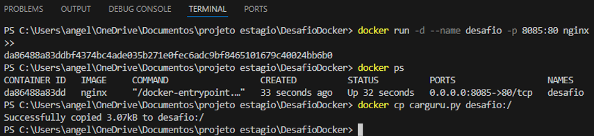

- Criando um arquivo Dockerfile para executar o script python carguru.py:

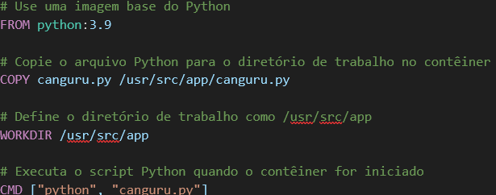

- Build - Criando uma imagem a partir de um arquivo Dockerfile:

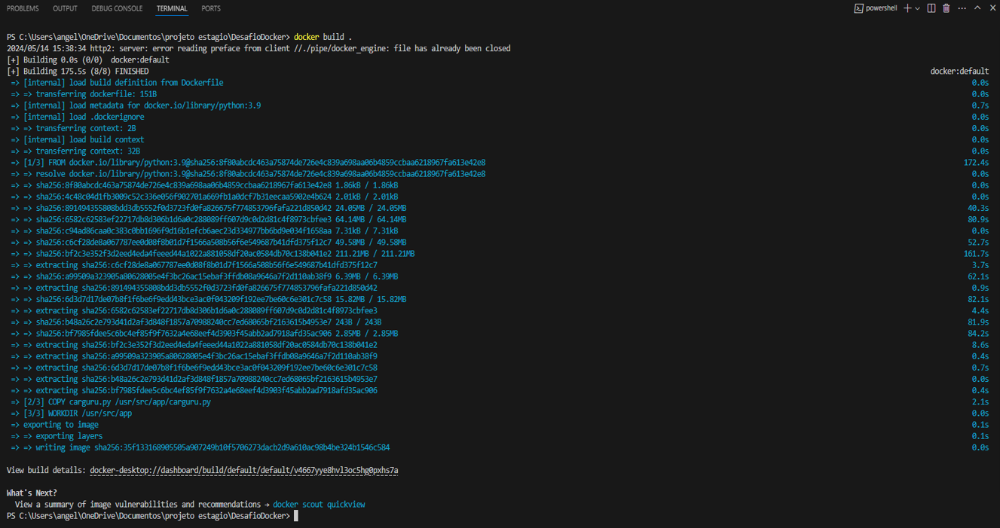

- Rodando a imagem:

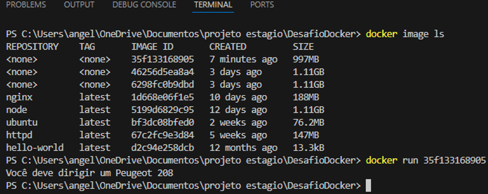

- Localhost:

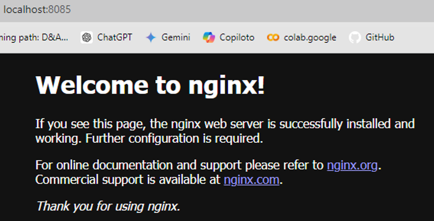

### Etapa 2

-  Reiniciando:
  
       Docker stop - para de rodar
       Docker start - reinicia 

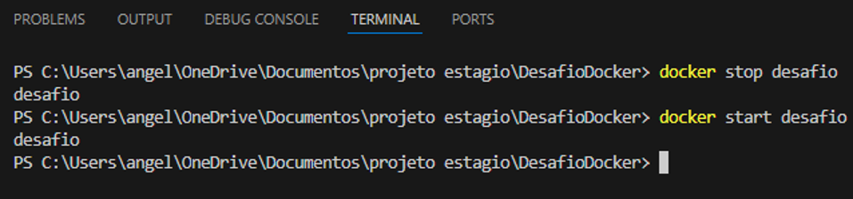

### Etapa 3

- Criando um arquivo Dockerfile:

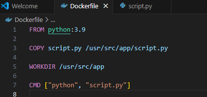

- Criando um script python:

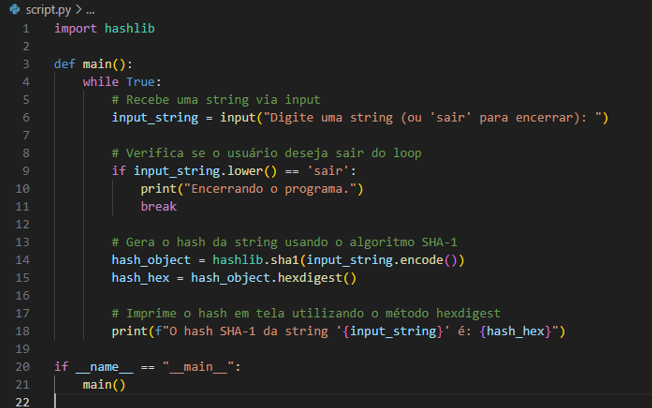

- Iniciando um novo container e copiando o script python:
 
       Docker run - inicia

       -d - executa em segundo plano

       --name - define o nome

       cp - copia 

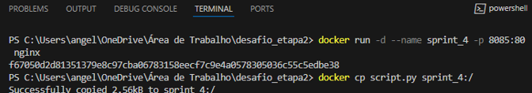

- Build - Criando uma imagem a partir de um arquivo Dockerfile:

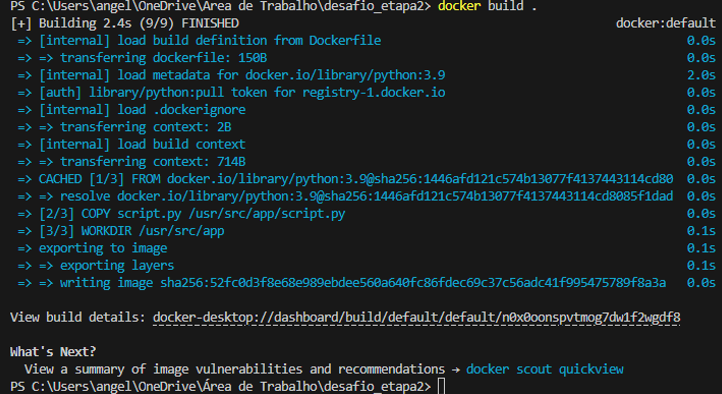

- Renomeando imagem:

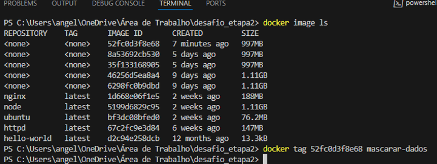

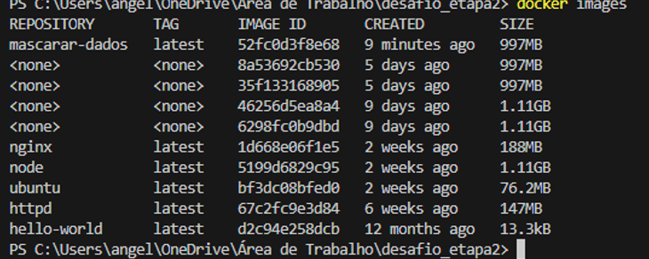

- Inicia o container:
       
       docker run
      -it - de maneira interativa

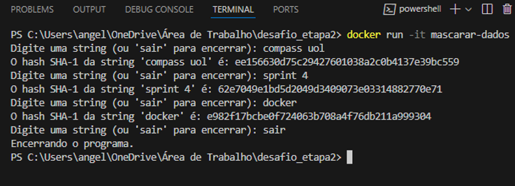

- Arquivos etapa 1 e 2: 
1. [carguru.py](../Desafio/parte_1/carguru.py)
2. [Dockerfile](../Desafio/parte_1/Dockerfile)

- Arquivos etapa 3:

1. [script.py](../Desafio/parte_2/script.py)
2. [Dockerfile](../Desafio/parte_2/Dockerfile)