# Exercícios

1. Exercicios

[Respostas de 1 a 7 em formato .ipynb com markdown separando](exercicios/exercicios.ipynb)

# Evidências

## Desafio 

### Etapa 1

 - Iniciando um novo container e copiando o script python:
 
       Docker run: inicia

       -d: executa em segundo plano

       --name: define o nome

       -p: porta

       nginx: servidor

       cp: copia 

      

- Criando um arquivo Dockerfile para executar o script python carguru.py:

- Build - Criando uma imagem a partir de um arquivo Dockerfile:

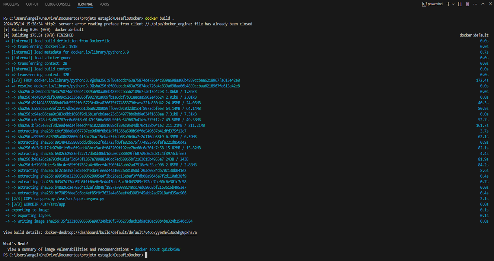

- Rodando a imagem:

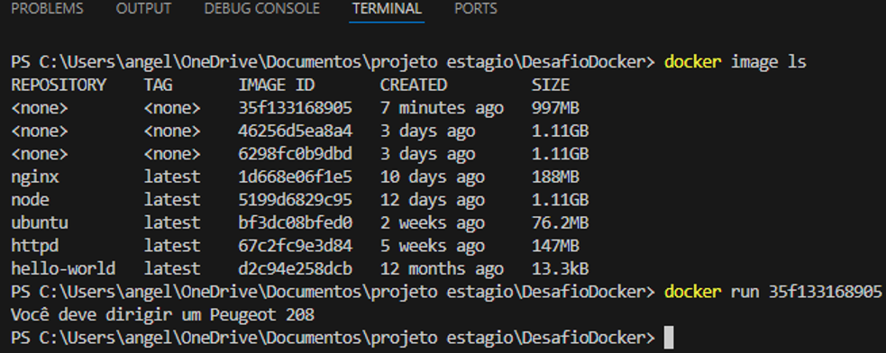

- Localhost:

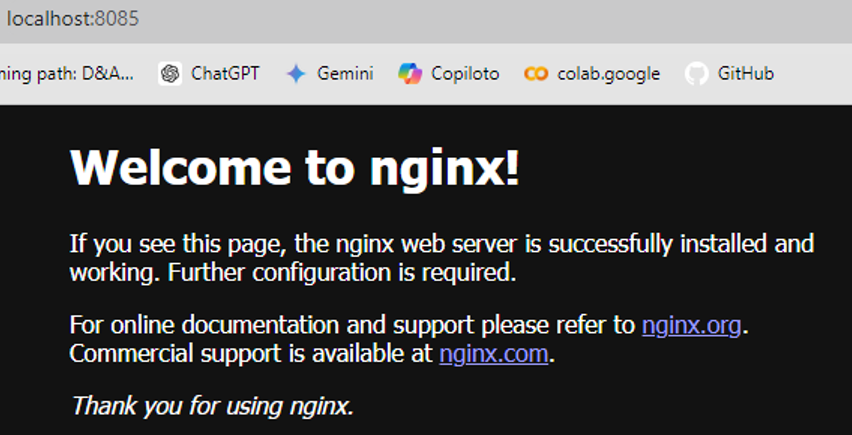

### Etapa 2

- Reiniciando:
  
      Docker stop - para de rodar
      Docker start - reinicia 

### Etapa 3

- Criando um arquivo Dockerfile:

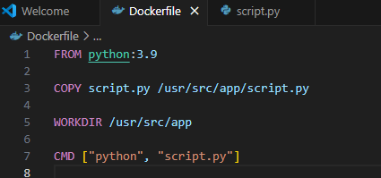

- Criando um script python:

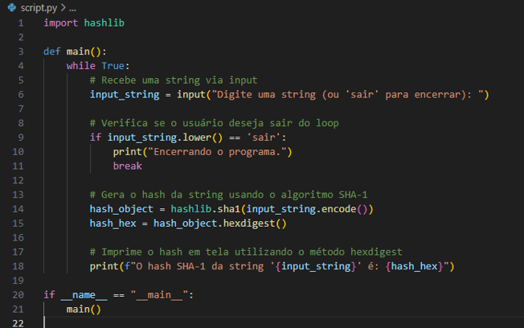

- Iniciando um novo container e copiando o script python:
 
       Docker run: inicia

       -d: executa em segundo plano

       --name: define o nome

       -p: porta

       nginx: servidor

       cp: copia 

- Build - Criando uma imagem a partir de um arquivo Dockerfile:

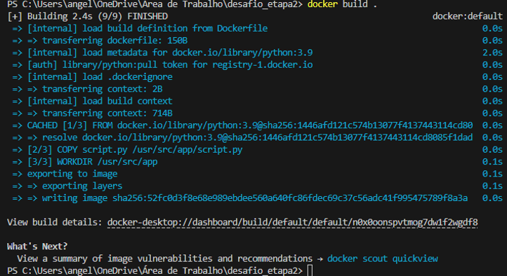

- Renomeando a imagem:
 
      docker tag <nome> <novo nome>

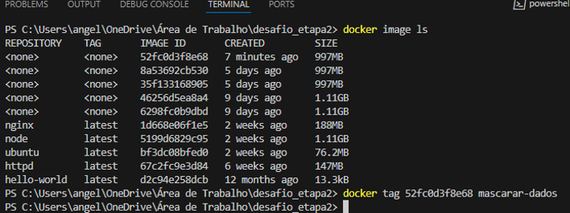

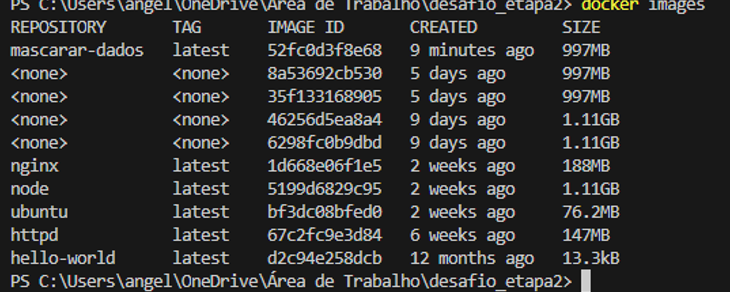

- Inicia o container:
       
       docker run
      -it: executa de maneira interativa

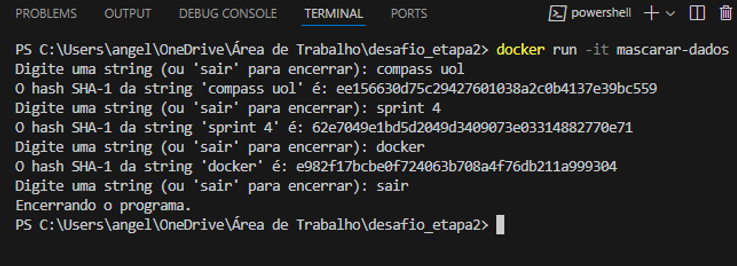

# Certificados

Certificados dos Cursos da AWS:

- Fundamentos Técnicos da AWS
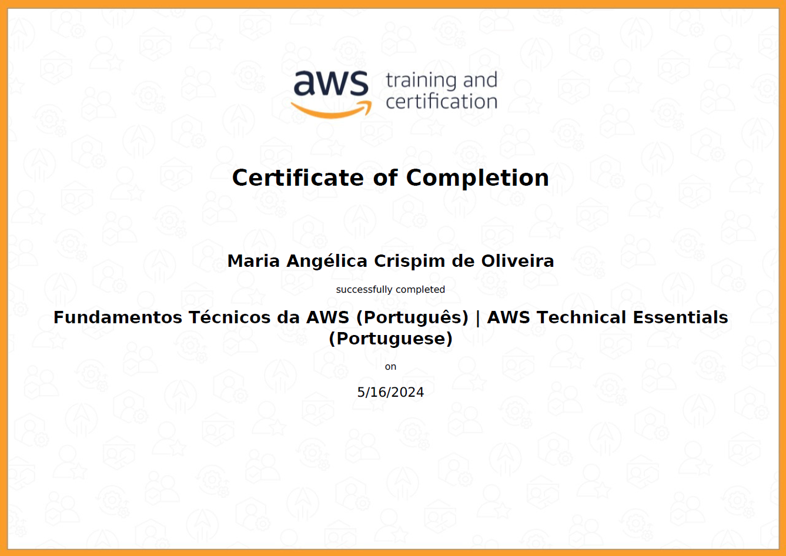

- AWS Partner: Credenciamento (Técnico)
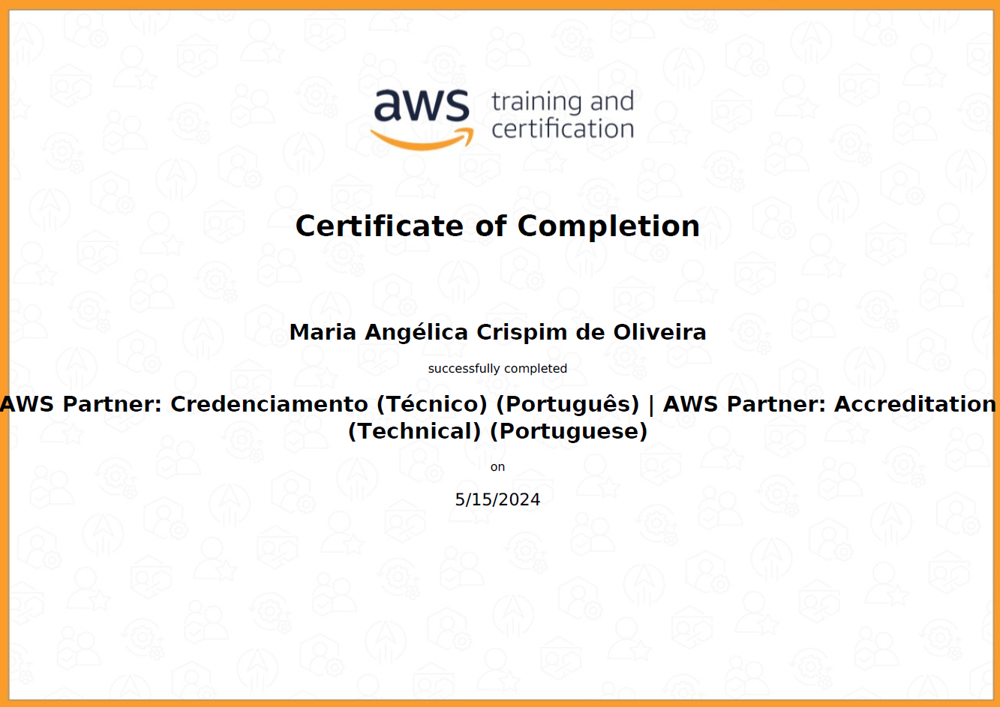

# Desafio

- Arquivos etapa 1 e 2: 
1. [carguru.py](Desafio/parte_1/carguru.py)
2. [Dockerfile](Desafio/parte_1/Dockerfile)

- Arquivos etapa 3:

1. [script.py](Desafio/parte_2/script.py)
2. [Dockerfile](Desafio/parte_2/Dockerfile)
