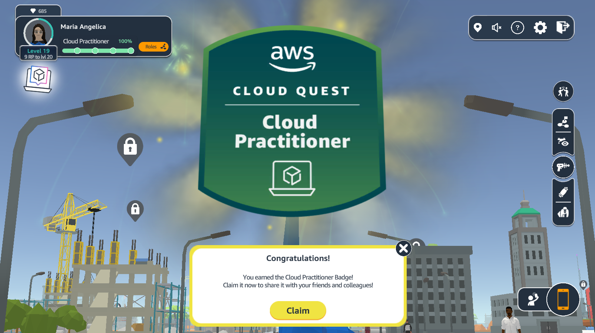
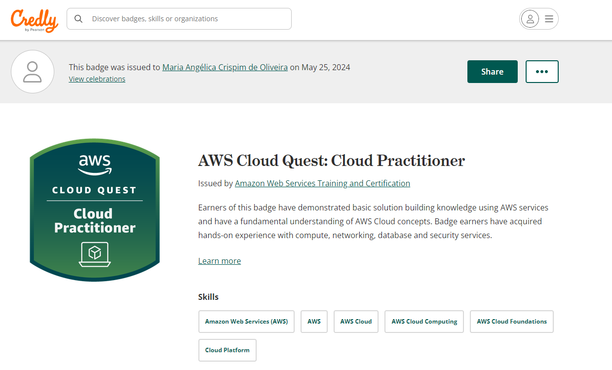
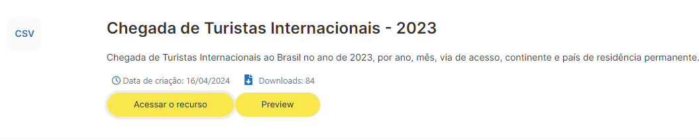
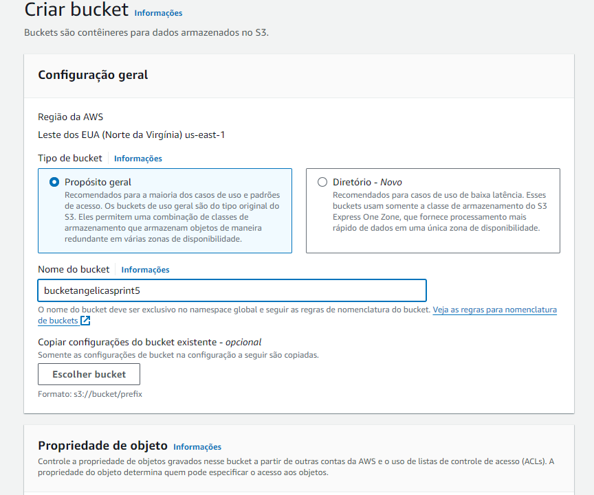
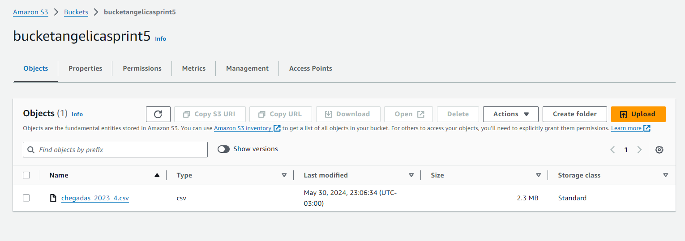
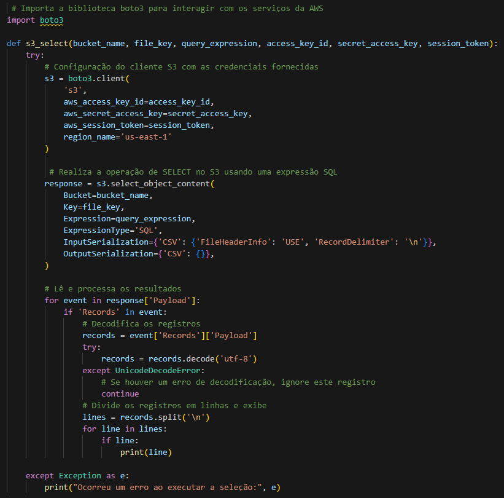
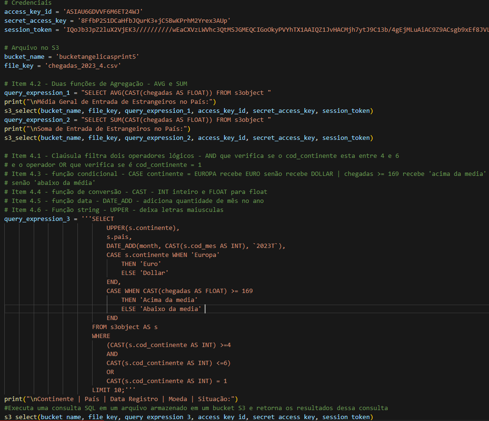
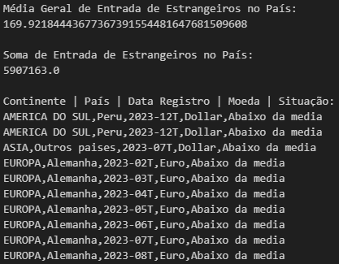
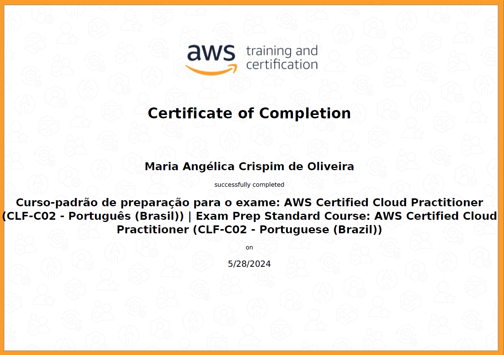
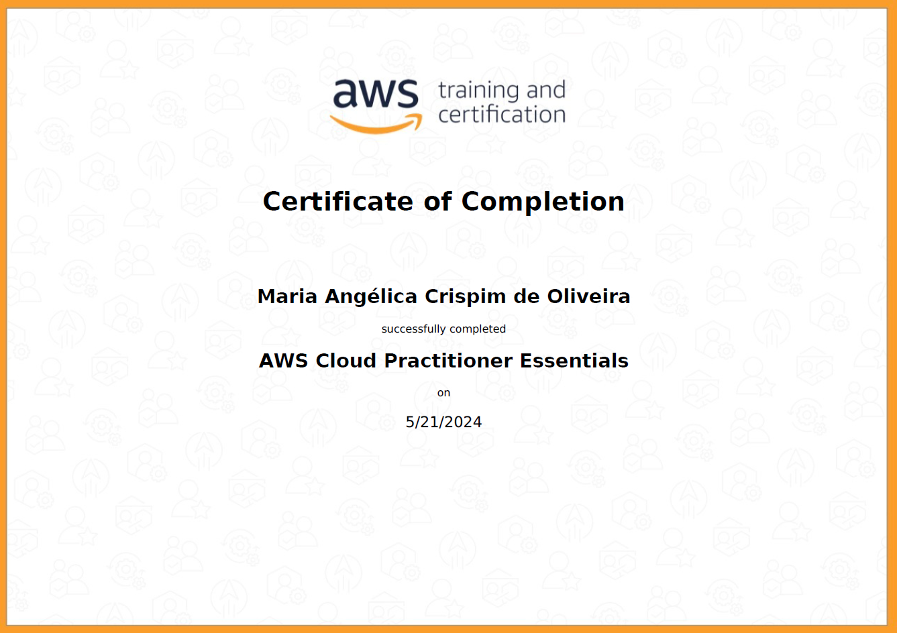

# Exercícios

1. Jogo

[Badge link](evidencias/jogo_badge/badge_link.txt)

# Evidências

## Jogo

## Desafio

### Arquivo CSV escolhido: 

### Etapa 1 - S3 - Criar um Bucket novo e carregar arquivo

      

### Etapa 2 - Código - usando VSCode

### Resultadodo Código:

# Certificados

Certificados dos Cursos da AWS:

- Curso-padrão de preparação para o exame:

- AWS Cloud Practitioner Essentials

# Desafio

- Arquivos  
1. [Desafio Python formato.py](Desafio/etapa-1/desafio5.py)
2. [Desafio Python formato.ipynb](Desafio/etapa-1/desafios5.ipynb)
3. [Código SQL em formato .txt](Desafio/etapa-1/SQL.txt)
4. [Arquivo CSV](Desafio/chegadas_2023_4.csv)

