# Exercícios
#### Os exercicíos estão separados por etapas.

## LAB AWS S3

### Etapa 1 - Criar um bucket

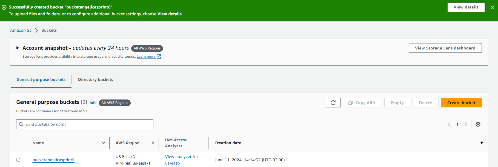

### Etapa 2 - Habilitar hospedagem de site estático

### Etapa 3 - Editar as configurações do Bloqueio de acesso público

### Etapa 4 - Adicionar política de bucket que torna o conteúdo do bucket publicamente disponível

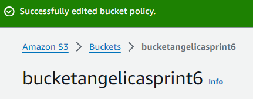

### Etapa 5 - Configurar um documento de índice

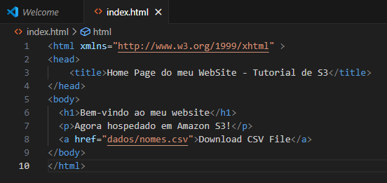

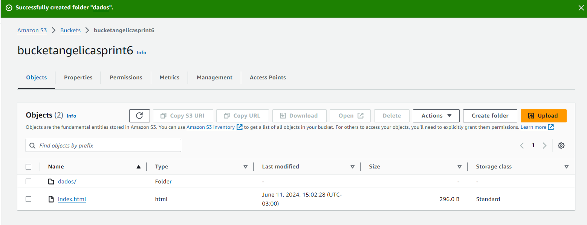

### Etapa 6 - Configurar documento de erros

### Etapa 7 - Testar o endpoint do site

## LAB AWS ATHENA

### Etapa 1 - Configurar Athena

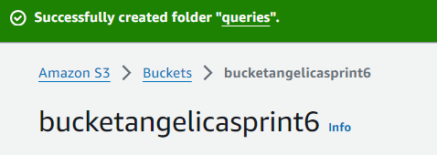

### Etapa 2 - Criar um banco de dados

### Etapa 3 - Criar uma tabela

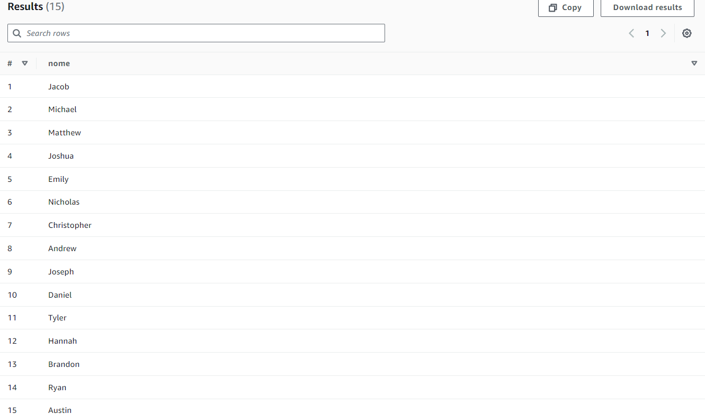

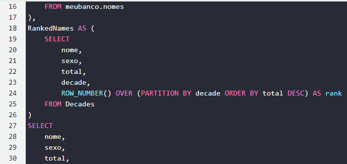
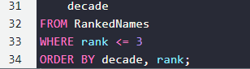
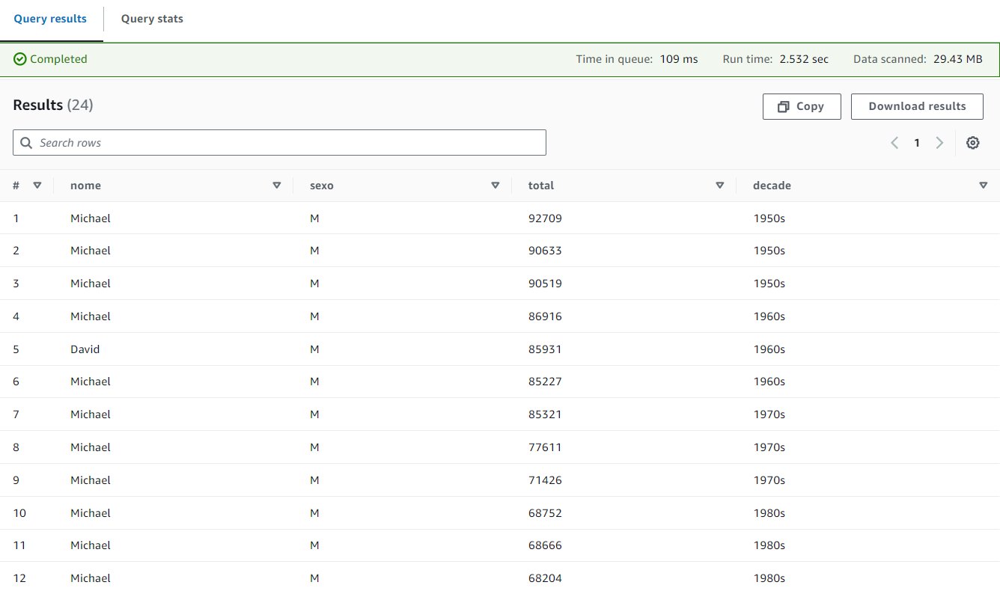

## LAB AWS S3 LAMBDA

### Etapa 1 - Criar a função do Lambda

### Etapa 2 - Construir o código

### Etapa 3 - Criar uma Layer

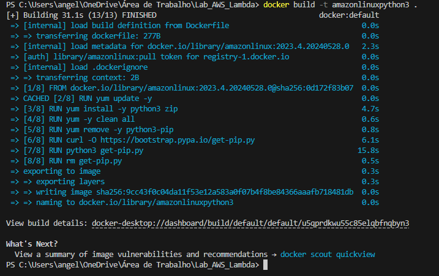

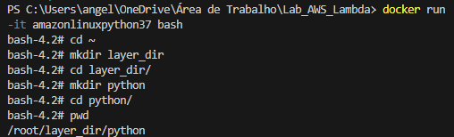
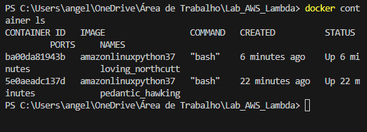

### Etapa 4 - Utilizando a Layer

