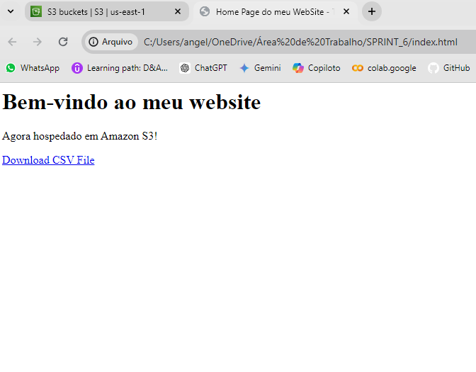
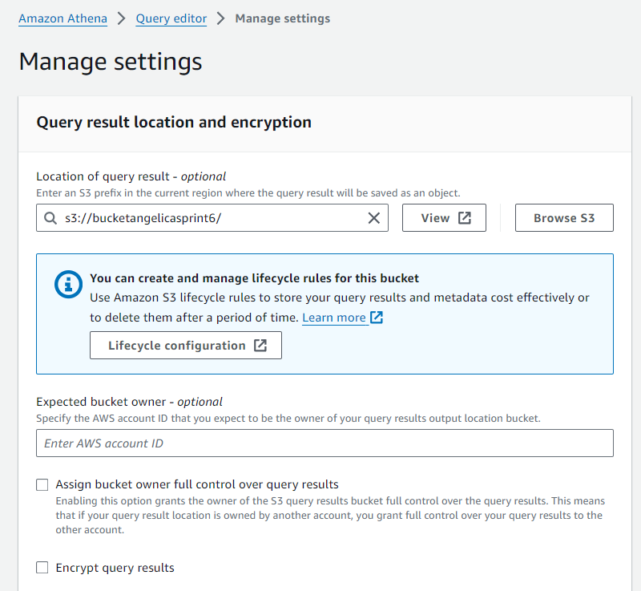

# Evidências - Exercícios
#### Os exercicíos estão separados por etapas.

## LAB AWS S3

### Etapa 1 - Criar um bucket

### Etapa 2 - Habilitar hospedagem de site estático

### Etapa 3 - Editar as configurações do Bloqueio de acesso público

### Etapa 4 - Adicionar política de bucket que torna o conteúdo do bucket publicamente disponível

### Etapa 5 - Configurar um documento de índice

### Etapa 6 - Configurar documento de erros

### Etapa 7 - Testar o endpoint do site

## LAB AWS ATHENA

### Etapa 1 - Configurar Athena

### Etapa 2 - Criar um banco de dados

### Etapa 3 - Criar uma tabela

## LAB AWS S3 LAMBDA

### Etapa 1 - Criar a função do Lambda

### Etapa 2 - Construir o código

### Etapa 3 - Criar uma Layer

### Etapa 4 - Utilizando a Layer

# Evidências - Desafio
## Parte 1
### Código Python: 

#### Primeiro, importei as bibliotecas:

#### Usei o arquivo .env para salvar as credenciais da AWS: 

#### Verifica as credenciais:

#### Imprime as credencias para verificação do arquivo .env: 

#### Função 'def' para pode ler os arquivos CSV; definir o caminho e exibir os DataFrames:

#### Usando boto3, cria um cliente S3:

#### Define o nome do bucket, verifica se ele já existe, caso ele não exista, cria um novo:

#### Função que faz upload de arquivos CSV para o S3:

## Parte 2
### Execução do Código Python: 

#### Resumo: Lendo os arquivos CSV, acessando a AWS, criando Bucket e fazendo upload dos arquivos no bucket: 

#### Upload dos arquivos feito com sucesso para o bucket no S3:

## Parte 3
### Arquivo Dockerfile
#### Define a imagem Docker personalizada para construir um contêiner que executa um script Python:

### Arquivo Docker-compose
#### Define a configuração para executar um serviço de contêiner Docker usando o Docker Compose:

### Arquivo .env
#### Credenciais da AWS:

### Arquivo Requirements
#### Lista as dependências do projeto código Python, definindo um conjunto de bibliotecas que são essenciais para o funcionamento do projeto python:

### Organização na pasta

## Parte 4
### Execução do Docker

#### Comando 'docker-compose build', para constuir as imagens dos containers especificados no arquivo 'docker-compose.yml'. Lê o arquivo 'docker-compose.yml, constroi as imagens e armazena as imagens:

#### Comando 'docker compase up', responsavel por iniciar e executar os contêiners definidos no arquivo 'docker-compose.yml'. Ele lê os arquivos, contrói as imagens, cria e inicializa os contêiners, aguarda os  contêineres iniciarem e exibe os Log. Assim, Redes e contêineres necessários foram criados corretamente e o contêiner está em execução.

      
### Resultado no S3
#### Bucket e os arquivos:

# Certificados

Certificados dos Cursos da AWS:

- Curso 1:

- Curso 2:

- Curso 3:

- Curso 4:

- Curso 5:

- Curso 6:

- Curso 7:

- Curso 8:

- Curso 9:

# Desafio
### Sobre o desafio:
O desafio é analisar um banco de dados para extrair informações específicas sobre séries e filmes do gênero ação/aventura. O objetivo é responder a questões definidas que nos permitam compreender melhor a história destes filmes e series, identificar modelos de popularidade, participação de artistas e outras características relevantes. 
Será feita uma análise para fornecer um panorama detalhado das séries e filmes de ação/aventura, facilitando a identificação das tendências recentes, da popularidade das séries e dos artistas, bem como da variedade de profissões envolvidas na produção, entre outros. Essas informações podem ser úteis para estudiosos de mídia, fãs de séries, filmes e profissionais da indústria do entretenimento que buscam entender melhor o mercado de séries de ação/aventura.

### Perguntas dos filmes de ação/aventura:

1. Quais são os títulos principais de filmes do gênero ação/aventura lançados nos últimos 10 anos?
2. Quais são os artistas que participaram de mais de um filme do gênero ação/aventura?
3. Quais são os filmes de ação/aventura com a maior nota média e mais de 1000 votos?
4. Quais são as profissões dos artistas que trabalharam em filmes de ação/aventura?  
5. Quais são os personagens principais dos filmes de ação/aventura que têm mais de 120 minutos de duração?

### Perguntas das séries de ação/aventura:

1. Quais são as séries do gênero ação/aventura lançadas nos últimos 5 anos?
2. Quais são os artistas que participaram de mais de uma série do gênero ação/aventura?
3. Quais são as séries de ação/aventura com a maior nota média e mais de 500 votos?
4. Quais são as profissões dos artistas que trabalharam em séries de ação/aventura?
5. Quais são os personagens principais das séries de ação/aventura que têm mais de 45 minutos de duração por episódio?

### Arquivos  
1. [Arquivo Python .py](Desafio/teste.py)
2. [Arquivo Dockerfile](Desafio/Dockerfile)
3. [Arquivo Docker-compose](Desafio/docker-compose.yml)
4. [Arquivo Requeriments.txt](Desafio/requirements.txt)
4. [Arquivos csv](Desafio/data)
5. [Arquivo .env](Desafio/.env)

