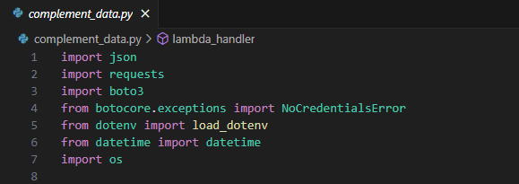
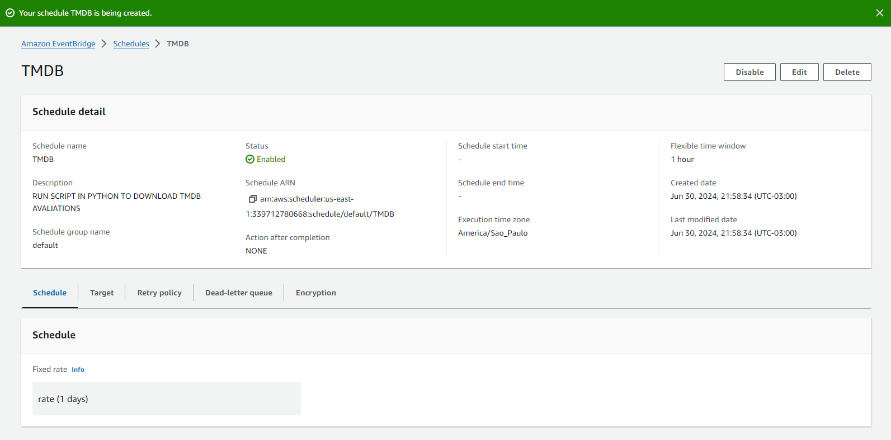

# Evidências - Exercícios

## SPARK

### Parte 1 

### Parte 2

### Parte 3

### Parte 4

### Parte 5

### Parte 6

### Parte 7

### Parte 8

## LAB GLUE

### Parte 1 

### Parte 2

### Parte 3

### Parte 4

### Parte 5

### Parte 6

### Parte 7

### Parte 8

### Parte 9

### Parte 10

### Parte 11

### Parte 12

### Parte 13

# Evidências - Desafio

### Arquivos  
1. [Arquivo Python Desafio](Desafio/etapas/complement_data.py)

## Parte 1
### API TMDB: 

#### Criei uma conta no site TMDB e criei uma API:

## Parte 2
### Arquivo .env e Código Python: 

#### Usei o arquivo .env  para armazenar informações sensíveis, como chaves de API e credenciais, de forma segura. 

#### Imports de bibliotecas para configur o ambiente para realizar tarefas como a interação com serviços da AWS entre outras funcionalidades necessárias para o funcionamento do script.

#### Carrega Informações das chave da API e credenciais da AWS

#### Carrega variáveis de ambiente usando a biblioteca os, útil para garantir que as informações sensíveis não estejam  no código, tornando mais seguro. 

#### Essa abordagem assegura que as credenciais sensíveis sejam usadas de forma segura e que as operações S3 sejam configuradas corretamente para o ambiente específico.

#### A função Lambda lambda_handler interage com a API do TMDB para obter dados sobre filmes populares e armazena esses dados no Amazon S3 em lotes de 100 registros. Ela começa configurando a URL da API do TMDB e os parâmetros necessários, faz uma requisição GET e processa a resposta JSON. Os dados são organizados por data e divididos em lotes, que são então carregados no S3. O código inclui tratamento de exceções para lidar com erros de credenciais da AWS, problemas na requisição à API do TMDB e outros erros genéricos, garantindo a robustez e a segurança da operação.

#### Permite que você teste a função Lambda localmente, verificando seu comportamento e a saída sem precisar implantá-la na AWS.

#### Executando o código 

### Lab AWS
### Lambda

#### Função Lambda

#### Executando o código na AWS Lambda

### Amazon Event Bridge

#### Agendando extrações periódicas de dados de forma automática usando Amazon Event Bridge

### S3

#### Resultao no S3

# Perguntas

### Perguntas dos filmes de ação/aventura:

1. Quais são os títulos principais de filmes do gênero ação/aventura lançados nos últimos 10 anos?
2. Quais são os artistas que participaram de mais de um filme do gênero ação/aventura?
3. Quais são os filmes de ação/aventura com a maior nota média e mais de 1000 votos?
4. Quais são as profissões dos artistas que trabalharam em filmes de ação/aventura?  
5. Quais são os personagens principais dos filmes de ação/aventura que têm mais de 120 minutos de duração?

### Perguntas das séries de ação/aventura:

1. Quais são as séries do gênero ação/aventura lançadas nos últimos 5 anos?
2. Quais são os artistas que participaram de mais de uma série do gênero ação/aventura?
3. Quais são as séries de ação/aventura com a maior nota média e mais de 500 votos?
4. Quais são as profissões dos artistas que trabalharam em séries de ação/aventura?
5. Quais são os personagens principais das séries de ação/aventura que têm mais de 45 minutos de duração por episódio?

# Certificados

Essa Sprint não teve cursos da AWS para obter certificados.

