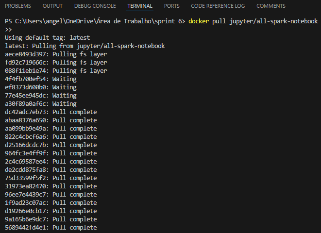
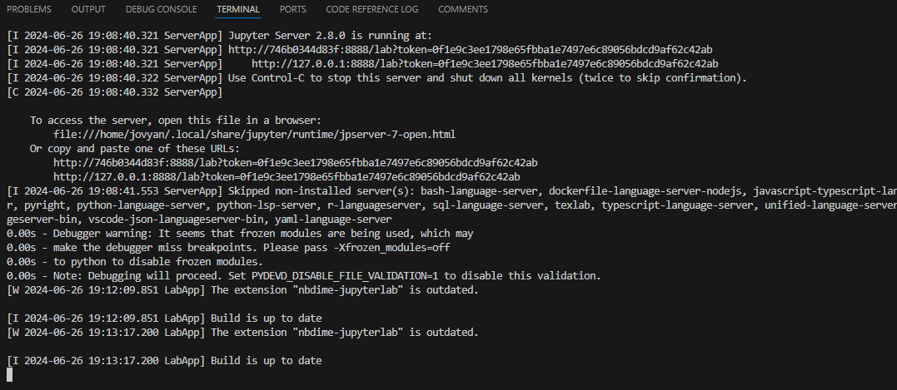
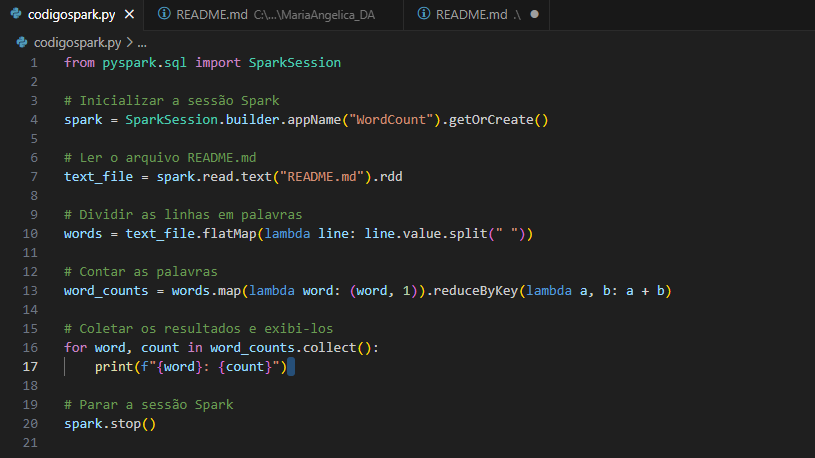
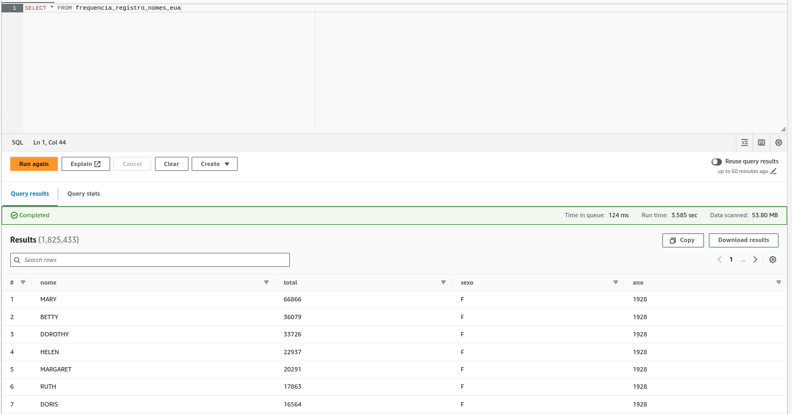

#  Exercícios

## SPARK

### Parte 1 

### Parte 2

### Parte 3

### Parte 4

### Parte 5

### Parte 6

### Parte 7

### Parte 8

## LAB GLUE

### Parte 1 

### Parte 2

### Parte 3

### Parte 4

### Parte 5

### Parte 6

### Parte 7

### Parte 8

### Parte 9

### Parte 10

### Parte 11

### Parte 12

### Parte 13

