# Evidências - Exercícios e Desafio

#### OBS.: O arquivo "nomes_aleatorios.txt" do exercício de spark não esta baixado nesse repositório por causa do tamanho grande, para não travar o git na hora dos update. 

## EXERCÍCIO 1 - APACHE SPARK

### Arquivos  
1. [Arquivo Python](exercicios/spark/codigocompleto.py)

### Parte 1 

### Parte 2

### Parte 3

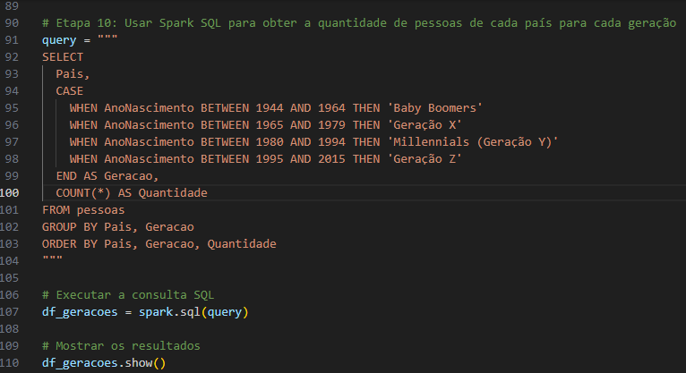

### Parte 4

### Parte 5

### Parte 6

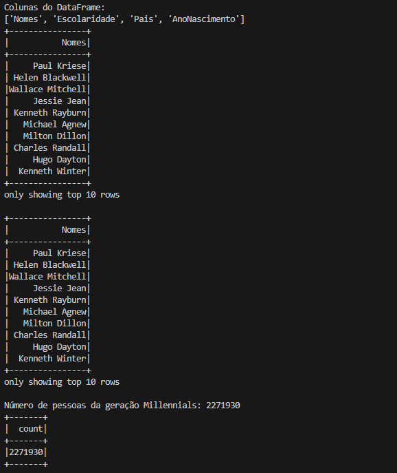

### Parte 7

_________________
## EXERCÍCIO 2 - GERAÇÃO E MASSA DE DADOS

### Arquivos  
1. [Arquivo csv animais](exercicios/dados/animais.csv)
2. [Arquivo Python etapa 1](exercicios/dados/etapa1.py)
3. [Arquivo Python etapa 2](exercicios/dados/etapa2.py)
4. [Arquivo Python etapa 3](exercicios/dados/etapa3.py)

### Parte 1 

### Parte 2

### Parte 3

### Parte 4

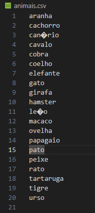

### Parte 5

### Parte 6

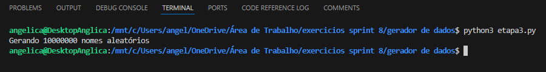

### Parte 7

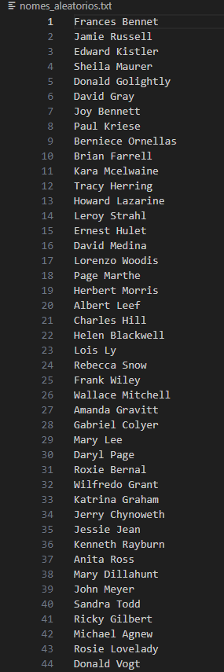

______________________
## EXERCÍCIO 3 - TMDB

### Arquivos  
1. [Arquivo Python](exercicios/tmdb/tmdb.py)

### Parte 1 

### Parte 2

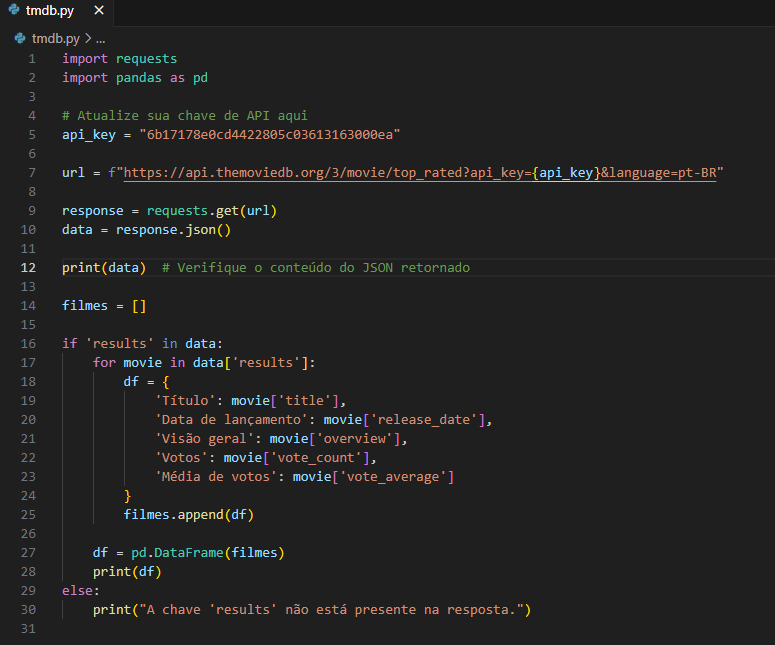

### Parte 3

### Parte 4

_______________________
# Evidências - Desafio

### Arquivos  
1. [Arquivo Python Job 1 - csv series e movies](Desafio/job_series_movies.py)
2. [Arquivo Python Job 2 - json tmdb](Desafio/job_tmdb.py)

## 1. AWS Glue

### Usei o AWS Glue Studio para criar e gerenciar tarefas de ETL, dos jobs "moviesAndSeries" e "jsonTMDB".
 
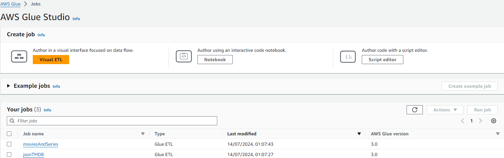

## 2. Código comentado do Job "moviesAndSeries"

### Importações para configur o ambiente para um script ETL no AWS Glue, integrando Spark e funcionalidades específicas do Glue para realizar transformações de dados.
 
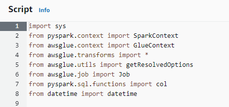

### Este trecho configura o ambiente necessário para um job ETL, incluindo a inicialização dos contextos do Spark e do Glue, e a preparação do job para execução.

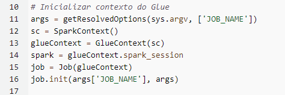

### Este trecho de código define uma função que lê dados de um arquivo CSV, filtra registros com gêneros Action/Adventure, verifica se há valores nulos e salva os dados filtrados no formato Parquet.

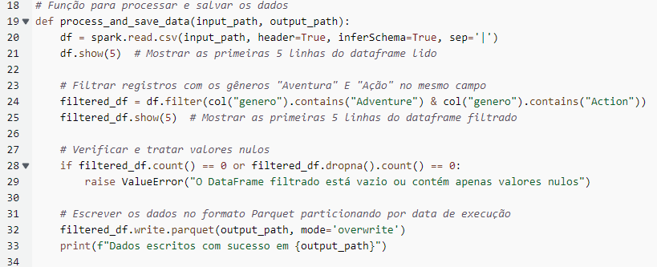

### Este trecho define uma variável execution_date que contém a data atual formatada, que pode ser utilizada para criar diretórios ou caminhos de arquivos baseados na data, ajudando a organizar os dados de entrada e saída por data de execução.

### Este trecho configura os caminhos de entrada e saída para os dados de filmes e séries, armazenando-os em um bucket S3 e organizando os dados processados em diretórios com base na data de execução.

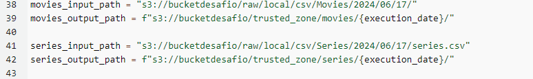

### Este trecho tenta processar e salvar os dados de filmes e séries, exibindo mensagens de erro específicas se ocorrer algum problema durante o processamento.

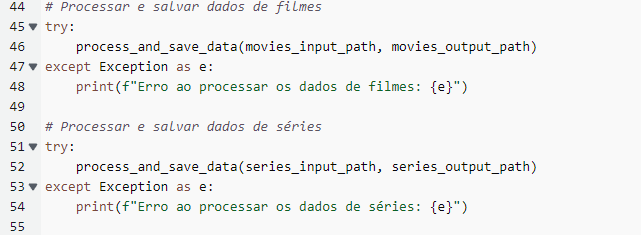

### Este trecho de código assegura que o job do AWS Glue seja devidamente encerrado, permitindo que o status do job seja atualizado e registrado no console do AWS Glue.

### 3. Execuções do job

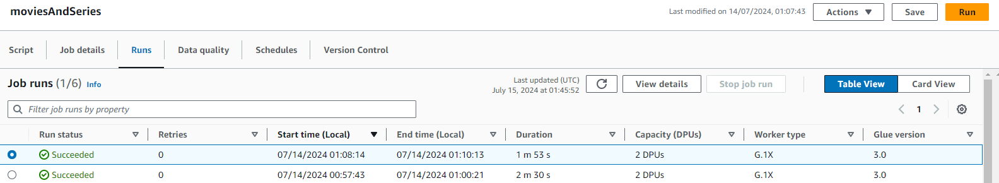

### Arquivos Parquet gerados pelo job "moviesAndSeries" do AWS Glue e salvos no bucket S3 na pasta correspondente à data de execução. Cada arquivo representa uma parte dos dados processados. 

### "movies"
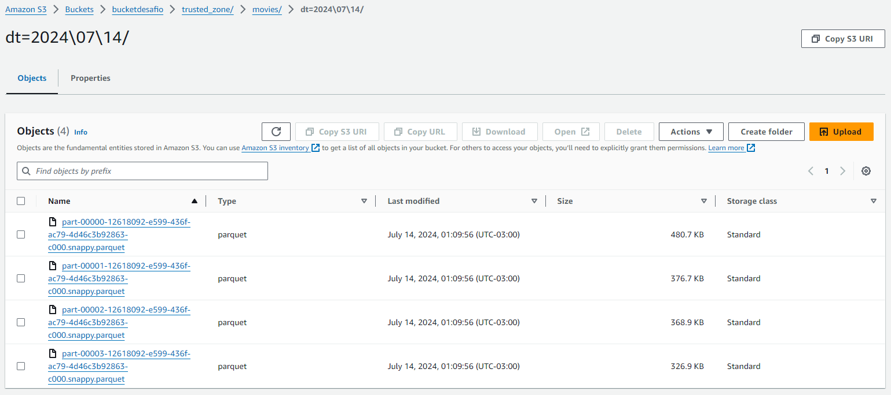

### "series"

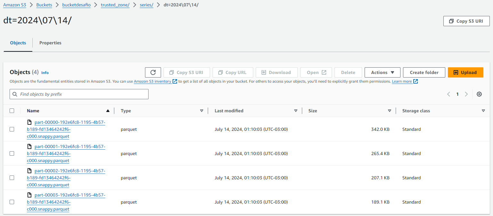

## 4. Athena - job "moviesAndSeries"

### Consulta dos dados "movies" armazenados no Amazon S3 usando SQL 

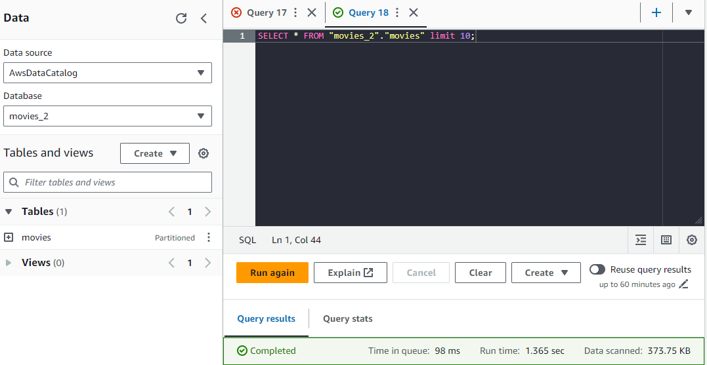

### Resultado da consulta 

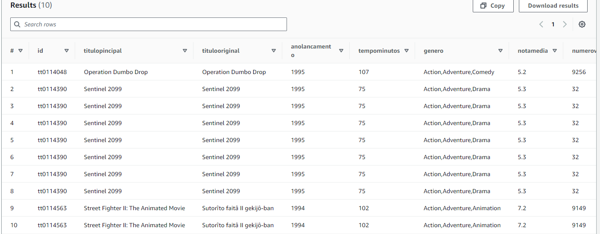

### Consulta dos dados "series" armazenados no Amazon S3 usando SQL 

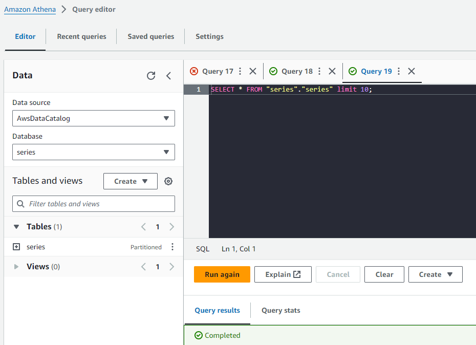

### Resultado da consulta 

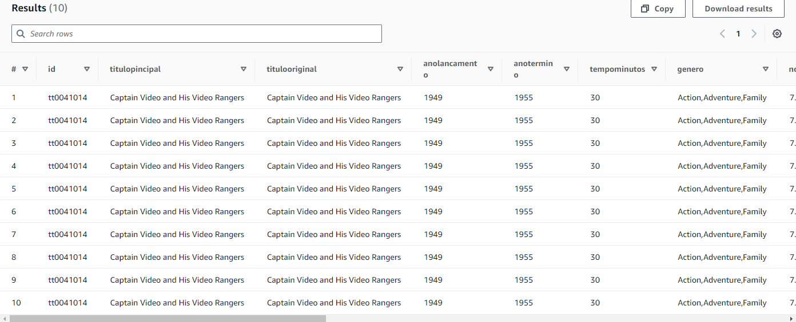

## 5. Código comentado do Job "moviesAndSeries"
 
### Configurações de ambiente para executar um job ETL, integrando funcionalidades do Spark e do Glue para realizar transformações de dados e gerenciamento de jobs.

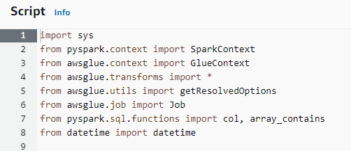

### Este trecho configura o ambiente necessário para um job ETL, incluindo a inicialização dos contextos do Spark e do Glue, e a preparação do job para execução.

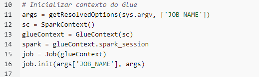

### Este trecho de código define uma função que lê dados de um arquivo JSON, filtra registros com IDs de gênero Action/Adventure, verifica se há valores nulos e salva os dados filtrados no formato Parquet.

### Este trecho define uma variável execution_date que contém a data atual formatada.

### Este trecho configura os caminhos de entrada e saída para os dados JSON do TMDB, armazenando-os em um bucket S3 e organizando os dados processados em diretórios com base na data de execução.

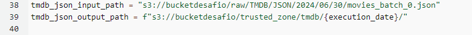

### Este trecho  processa e salva os dados JSON do TMDB, exibindo uma mensagem de erro específica se ocorrer algum problema durante o processamento.

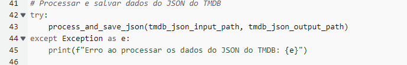

### Este trecho de código assegura que o job do AWS Glue seja devidamente encerrado, permitindo que o status do job seja atualizado e registrado no console do AWS Glue.

## 6. Execução do job "tmdb"

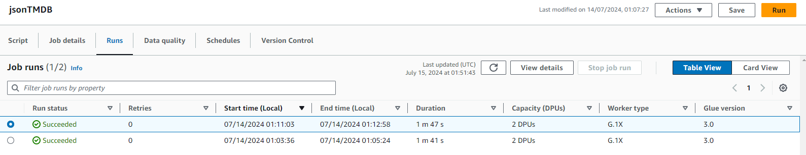

### Arquivos Parquet gerados pelo job "tmdb" do AWS Glue e salvos no bucket S3 na pasta correspondente à data de execução.

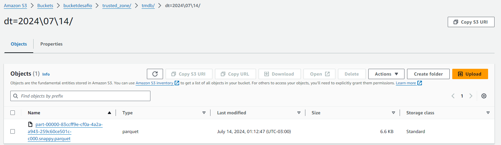

## 7. Athena - job "tmdb"

### Consulta dos dados "tmdb" armazenados no Amazon S3 usando SQL 

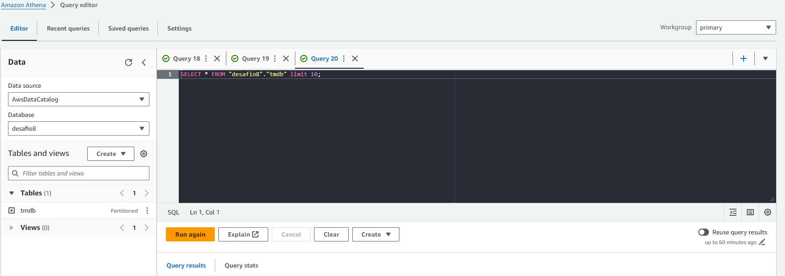

### Resultado da consulta

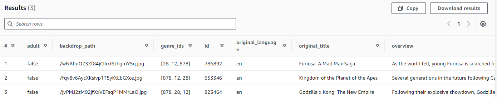

