# Exercícios 

## EXERCÍCIO 1 - APACHE SPARK

### Arquivos  
1. [Arquivo Python](../exercicios/spark/codigocompleto.py)
2. [Arquivo txt](../exercicios/spark/nomes_aleatorios.txt)

### Parte 1 

### Parte 2

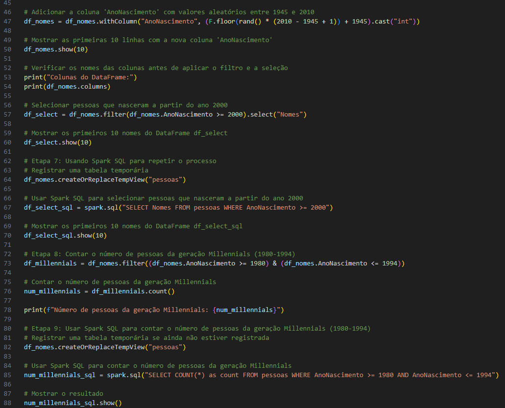

### Parte 3

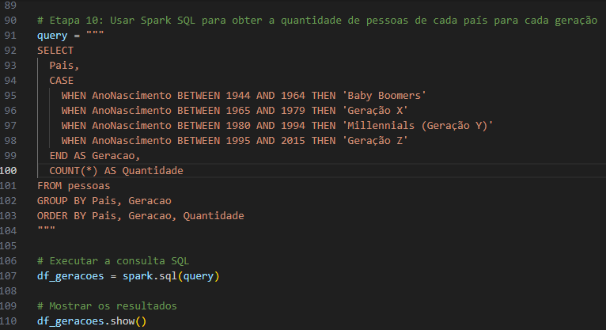

### Parte 4

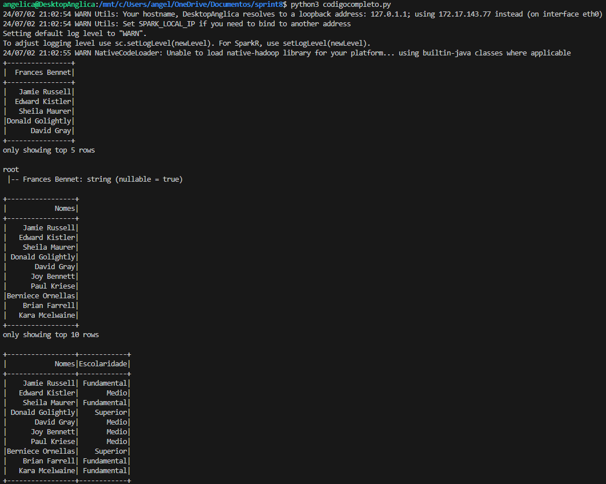

### Parte 5

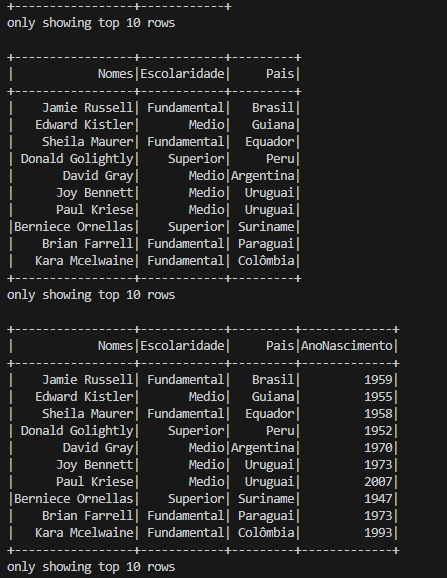

### Parte 6

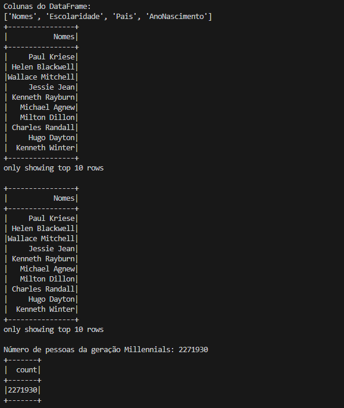

### Parte 7

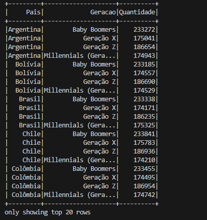

_________________
## EXERCÍCIO 2 - GERAÇÃO E MASSA DE DADOS

### Arquivos  
1. [Arquivo csv animais](../exercicios/dados/animais.csv)
2. [Arquivo Python etapa 1](../exercicios/dados/etapa1.py)
3. [Arquivo Python etapa 2](../exercicios/dados/etapa2.py)
4. [Arquivo Python etapa 3](../exercicios/dados/etapa3.py)

### Parte 1 

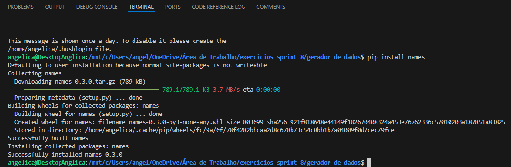

### Parte 2

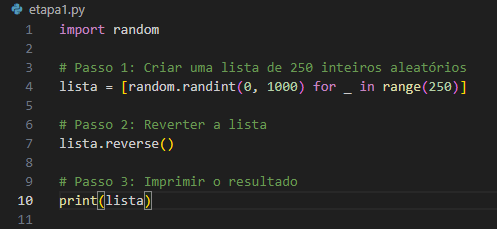

### Parte 3

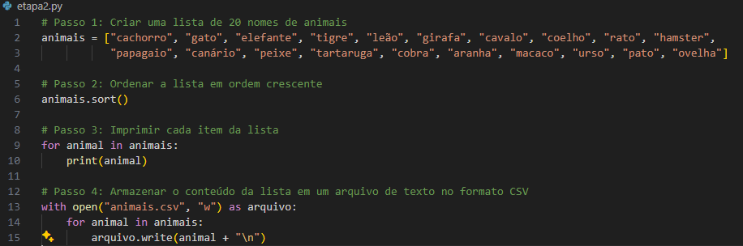

### Parte 4

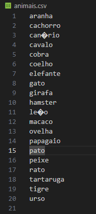

### Parte 5

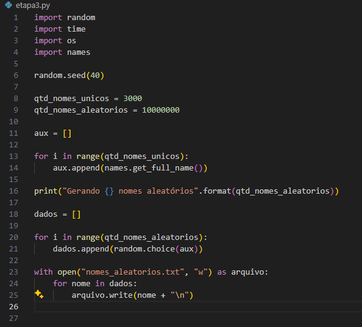

### Parte 6

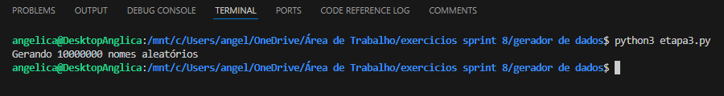

### Parte 7

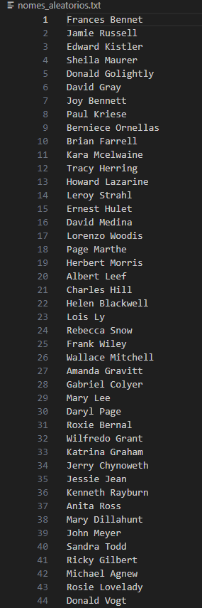

______________________
## EXERCÍCIO 3 - TMDB

### Arquivos  
1. [Arquivo Python](../exercicios/tmdb/tmdb.py)

### Parte 1 

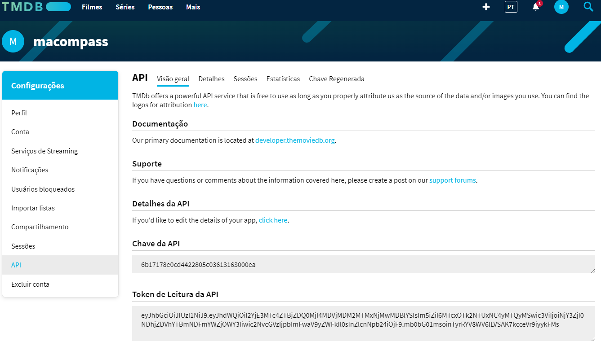

### Parte 2

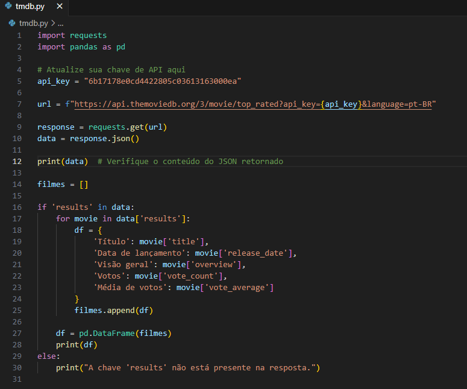

### Parte 3

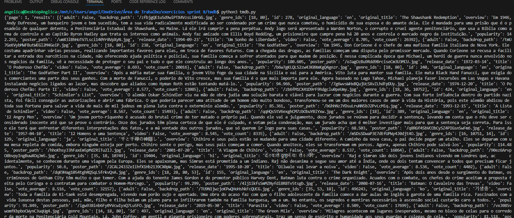

### Parte 4

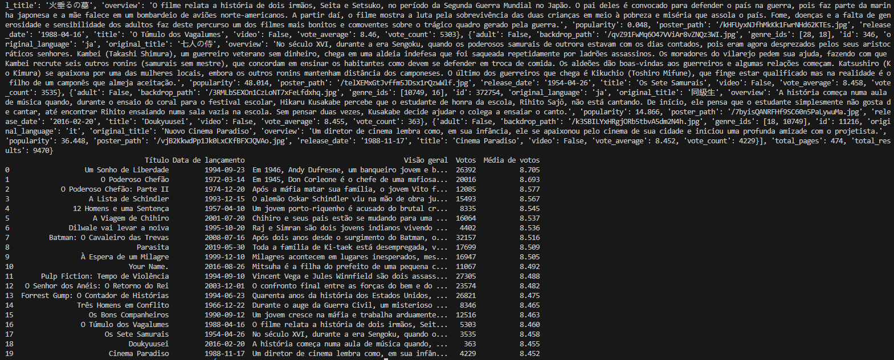

