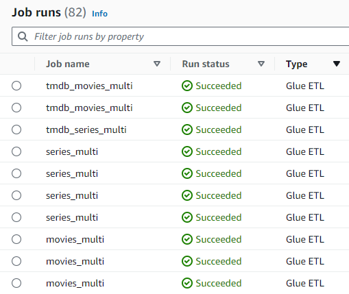
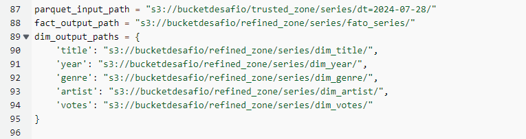

# Resolução do  Desafio

### Observações:

#### 1. Para explorar melhor os dados, adicionei mais dados do tmdb movies e acrescentei séries também, usando mesmo código e o mesmo passo a passo da sprint 7, só mudando a URL da API do TMDB.

#### 2. Na sprint anterior,  já havia refinado os dados selecionando o gênero especifico aventura e ação. 

#### 3. São 4 arquivos de dados ao todo (TMDB de series e TMDB de filmes;  e os arquivos disponobilizados pelo desafio nas sprint passadas de filmes e series). Como o processo é o mesmo, os códigos são parecidos, tendo apenas algumas alterações.

### Arquivos Refined - Modelagem:
1. [Arquivo Movies ](../Desafio/refined/movies_multi.py)
2. [Arquivo Series ](../Desafio/refined/series_multi.py)
3. [Arquivo TMDB Movies ](../Desafio/refined/tmdb_movies_multi.py)
4. [Arquivo TMDB Series ](../Desafio/refined/tmdb_series_multi.py)

## Resumo:
### O desafio foi resolvido de duas maneiras:
### A primeira usando glue para ler o arquivo parquet na trusted zone, modificá-lo  e salva-lo na refined zone. Depois usei o crawler pegar os dados salvos no refined zone que estavam no formato parquet e criar um banco de dados no athena.
### A segunda forma usei o athena para fazer um select no banco de dados series e criar a tabela fato.

## 1. AWS Glue

### Usei o AWS Glue Studio para criar jobs onde fiz os scripts para a camada refined e fazer a modelagem tabelas de fato e tabela dimensão.
 

### Job runs funcionando com sucesso: 

## 2. Código comentado do Job "movies"

### Esse trecho do código configura o ambiente e as bibliotecas necessárias para escrever um script com AWS Glue e PySpark:

### Este trecho do código configura o ambiente necessário para executar um o job, preparando o contexto do Glue, que combina funcionalidades do Spark com integrações AWS, e inicializa o job para que possa ser monitorado e gerenciado pelo AWS Glue.

### Essa função lê dados de um arquivo Parquet, processa os dados para criar uma tabela de fatos e várias tabelas de dimensões, verifica se os dados são válidos e, em seguida, escreve essas tabelas em novos arquivos Parquet, tratando qualquer exceção que possa ocorrer no processo.

  

### Caminho para os dados de entrada e saída:

       

### Aqui estou configurando os caminhos no Amazon S3 para onde os dados Parquet serão lidos e escritos. A variável parquet_input_path aponta para a localização dos dados de entrada, enquanto fact_output_path e dim_output_paths definem onde as tabelas de fato e de dimensões serão salvas após o processamento. Isso organiza e estrutura os dados em diferentes zonas (trusted e refined) dentro do bucket S3.

### Processar e salvar dados do Parquet - executa a função process_and_save_multidimensional para processar e salvar dados Parquet nos caminhos especificados no Amazon S3. Caso ocorra alguma exceção durante a execução, a exceção será capturada e uma mensagem de erro será impressa, detalhando o problema. 

### Encerrar o job do Glue

## Refined Zone no bucket do S3 -  dos scripts feito no Glue:

### Movies

### Series

### TMDB Movies

### TMDB Series

## 3. Código comentado do Job "series"

### Esse trecho do código configura o ambiente e as bibliotecas necessárias para escrever um script com AWS Glue e PySpark:

### Este trecho do código configura o ambiente necessário para executar um o job, preparando o contexto do Glue, que combina funcionalidades do Spark com integrações AWS, e inicializa o job para que possa ser monitorado e gerenciado pelo AWS Glue.

### Essa função lê dados de um arquivo Parquet, processa os dados para criar uma tabela de fatos e várias tabelas de dimensões, verifica se os dados são válidos e, em seguida, escreve essas tabelas em novos arquivos Parquet, tratando qualquer exceção que possa ocorrer no processo.

  

### Caminho para os dados de entrada e saída:

       

### Aqui estou configurando os caminhos no Amazon S3 para onde os dados Parquet serão lidos e escritos. A variável parquet_input_path aponta para a localização dos dados de entrada, enquanto fact_output_path e dim_output_paths definem onde as tabelas de fato e de dimensões serão salvas após o processamento. Isso organiza e estrutura os dados em diferentes zonas (trusted e refined) dentro do bucket S3.

### Processar e salvar dados do Parquet - executa a função process_and_save_multidimensional para processar e salvar dados Parquet nos caminhos especificados no Amazon S3. Caso ocorra alguma exceção durante a execução, a exceção será capturada e uma mensagem de erro será impressa, detalhando o problema. 

### Encerrar o job do Glue

## 4. Código comentado do Job "tmdb movies"

### Esse trecho do código configura o ambiente e as bibliotecas necessárias para escrever um script com AWS Glue e PySpark:

### Este trecho do código configura o ambiente necessário para executar um o job, preparando o contexto do Glue, que combina funcionalidades do Spark com integrações AWS, e inicializa o job para que possa ser monitorado e gerenciado pelo AWS Glue.

### Essa função lê dados de um arquivo Parquet, processa os dados para criar uma tabela de fatos e várias tabelas de dimensões, verifica se os dados são válidos e, em seguida, escreve essas tabelas em novos arquivos Parquet, tratando qualquer exceção que possa ocorrer no processo.

  

### Caminho para os dados de entrada e saída:

       

### Aqui estou configurando os caminhos no Amazon S3 para onde os dados Parquet serão lidos e escritos. A variável parquet_input_path aponta para a localização dos dados de entrada, enquanto fact_output_path e dim_output_paths definem onde as tabelas de fato e de dimensões serão salvas após o processamento. Isso organiza e estrutura os dados em diferentes zonas (trusted e refined) dentro do bucket S3.

### Processar e salvar dados do Parquet - executa a função process_and_save_multidimensional para processar e salvar dados Parquet nos caminhos especificados no Amazon S3. Caso ocorra alguma exceção durante a execução, a exceção será capturada e uma mensagem de erro será impressa, detalhando o problema. 

### Encerrar o job do Glue

## 5. Código comentado do Job "tmdb series"

### Esse trecho do código configura o ambiente e as bibliotecas necessárias para escrever um script com AWS Glue e PySpark:

### Este trecho do código configura o ambiente necessário para executar um o job, preparando o contexto do Glue, que combina funcionalidades do Spark com integrações AWS, e inicializa o job para que possa ser monitorado e gerenciado pelo AWS Glue.

### Essa função lê dados de um arquivo Parquet, processa os dados para criar uma tabela de fatos e várias tabelas de dimensões, verifica se os dados são válidos e, em seguida, escreve essas tabelas em novos arquivos Parquet, tratando qualquer exceção que possa ocorrer no processo.

  

### Caminho para os dados de entrada e saída:

       

### Aqui estou configurando os caminhos no Amazon S3 para onde os dados Parquet serão lidos e escritos. A variável parquet_input_path aponta para a localização dos dados de entrada, enquanto fact_output_path e dim_output_paths definem onde as tabelas de fato e de dimensões serão salvas após o processamento. Isso organiza e estrutura os dados em diferentes zonas (trusted e refined) dentro do bucket S3.

### Processar e salvar dados do Parquet - executa a função process_and_save_multidimensional para processar e salvar dados Parquet nos caminhos especificados no Amazon S3. Caso ocorra alguma exceção durante a execução, a exceção será capturada e uma mensagem de erro será impressa, detalhando o problema. 

### Encerrar o job do Glue

## Refined Zone no bucket do S3 -  dos scripts feito no Glue:
### Modelagem dimensional separado por categorias: artista, genero, titulo, ano e tabela fato

### Movies

### Series

### TMDB Movies

### TMDB Series

## 6. Criando Crawlers

### Ferramentas catalogação de dados, facilitando o processamento e análise dos dados. 

## 7. Athena - Visualização das tabelas criadas no AWS Glue e as Views criadas no Athena

###  Tabelas

### Views

## Observação: 

### Como são muitas tabelas e Views, selecionei as principais para deixar como evidência, pois o processo de criação foi seguindo o mesmo padrão. 

## Tabelas: 
##  Tabelas Movies 

### Tabela Fato

### Titulo 

### Artista

### Genero

##  Tabelas Series

### Tabela Fato

### Titulo 

### Artista

### Genero

##  Tabelas TMDB Movies 

### Tabela Fato

### Titulo 

##  Tabelas TMDB Series

### Tabela Fato

### Titulo 

## Views - Criadas no Athena usando SQL

## Movies e TMDB Movies (Juntando as Duas tabelas de filmes)

## Series e TMDB Series (Juntando as Duas tabelas de series)

## Movies 

## Series

## TMDB Movies 

## TMDB Series

# FIM. 